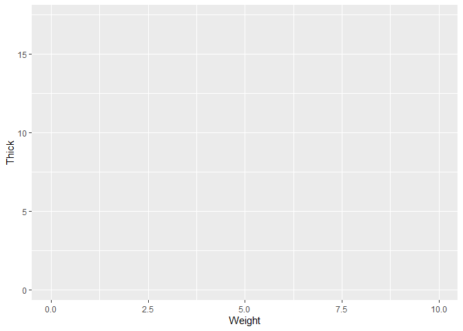
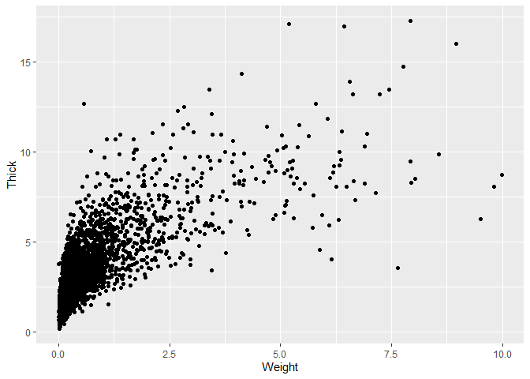
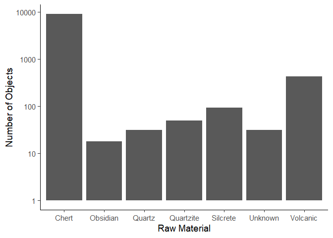
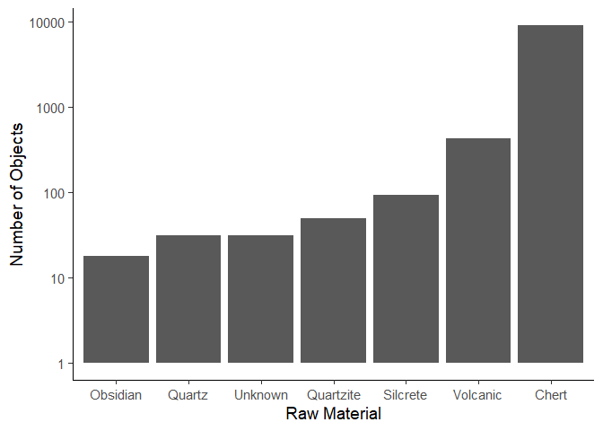
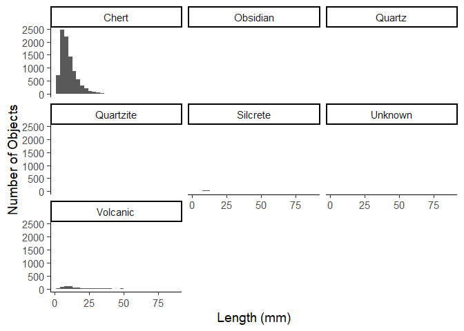
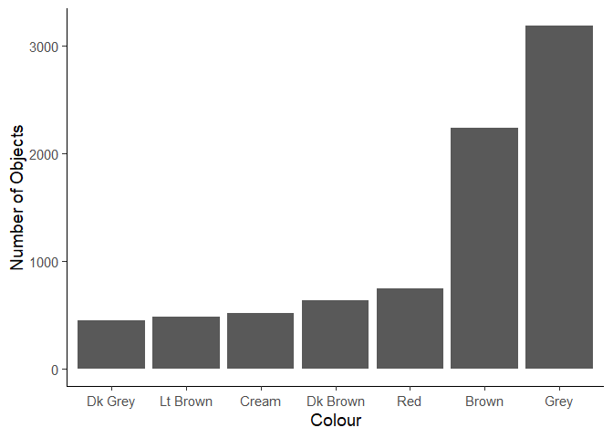

- [Homework assignments](#homework-assignments)
  - [Assignment 1](#assignment-1)
- [Assignment 2](#assignment-2)
- [Assignment 3](#assignment-3)

In this workshop, we will expand on some of the basic functions, use
tidyverse more and introduce some archaeology specific functions. It
will follow the flow of a more typical data analysis workflow. We will
work with data about lithics from the Jerimalai rockshelter in
East-Timor. This workshop has been inspired by the ‘tidyverse for
archaeologists’ workshop by Professor Ben Marwick.

Some of the code will be evaluated here, but some will not so please
copy and paste the code into your own script and run it there.

Load the `tidyverse` package.

``` r
library(tidyverse)
```

This data is coming from an URL, and it is an excel file. We
unfortunately cannot use tidyverse to read excel files, so we will use
the `rio` package.

Install the `rio` package.

``` r
install.packages("rio")
```

``` r
library(rio)
```

Load the data using `import`.

``` r
data <- import("https://bit.ly/j_data_xlsx", setclass = "tbl_df")
```

Let’s have a look at the data.

``` r
View(data)
summary(data)
```

``` r
nrow(data)
```

    ## [1] 9752

``` r
ncol(data)
```

    ## [1] 48

``` r
names(data)
```

    ##  [1] "Site"       "Square"     "Spit"       "Group"      "Artno"     
    ##  [6] "Material"   "Colour"     "Weight"     "Length"     "Artclas"   
    ## [11] "Cortex"     "Cortype"    "Initiat"    "Breaks"     "Noseg"     
    ## [16] "Platwid"    "Plat"       "Focal"      "Overhang"   "NoDS"      
    ## [21] "NoPS"       "Rtch"       "Plat_2"     "Focal_2"    "Overhang_2"
    ## [26] "NoDS_2"     "NoPS_2"     "Rtch_2"     "RetOri"     "Retype"    
    ## [31] "Retloc"     "Retlen"     "Retdep"     "Portion"    "Heat"      
    ## [36] "EdgeDam"    "Weathering" "Corerot"    "RetScNo"    "Term"      
    ## [41] "Janus"      "Recycled"   "Redirect"   "Width"      "Thick"     
    ## [46] "Platthic"   "area"       "elongation"

``` r
head(data)
```

    ## # A tibble: 6 × 48
    ##   Site  Square  Spit Group Artno Material Colour   Weight Length Artclas Cortex
    ##   <chr> <chr>  <dbl> <dbl> <dbl> <chr>    <chr>     <dbl>  <dbl> <chr>    <dbl>
    ## 1 J     B          1     1     1 Chert    Brown      1.83  22.0  Flake        0
    ## 2 J     B          1     1     2 Chert    Yellow     0.61  14.6  RetF         0
    ## 3 J     B          1     1     3 Chert    Dk Grey    3.81  29.6  Core         0
    ## 4 J     B          1     1     4 Chert    Grey       0.13   5.83 RetFrag      0
    ## 5 J     B          1     1     5 Chert    Grey       0.05   7.07 Flake        0
    ## 6 J     B          1     1     6 Chert    Lt Brown   0.58  11.1  Core        NA
    ## # ℹ 37 more variables: Cortype <chr>, Initiat <chr>, Breaks <chr>, Noseg <dbl>,
    ## #   Platwid <dbl>, Plat <chr>, Focal <lgl>, Overhang <chr>, NoDS <dbl>,
    ## #   NoPS <dbl>, Rtch <chr>, Plat_2 <chr>, Focal_2 <lgl>, Overhang_2 <chr>,
    ## #   NoDS_2 <dbl>, NoPS_2 <dbl>, Rtch_2 <chr>, RetOri <chr>, Retype <chr>,
    ## #   Retloc <chr>, Retlen <dbl>, Retdep <dbl>, Portion <chr>, Heat <dbl>,
    ## #   EdgeDam <dbl>, Weathering <dbl>, Corerot <dbl>, RetScNo <dbl>, Term <chr>,
    ## #   Janus <lgl>, Recycled <lgl>, Redirect <lgl>, Width <dbl>, Thick <dbl>, …

We will select the `Square`, `Spit` and `Weight` columns. Note that we
can select multiple columns in one go using the comma.

``` r
data %>% 
  select(Square, Spit, Weight)
```

Alternatively, if we only want columns that have numbers, we can use the
`where` function.

``` r
data %>% 
  select(where(is.numeric))
```

We now want to get into plotting our data. For this we are only
interested in the `Square`, `Spit`, `Material`, `Weight` and `Thick`
columns.

``` r
plotting_data <- data %>% 
  select(Square, Spit, Material, Weight, Thick)
plotting_data
```

    ## # A tibble: 9,752 × 5
    ##    Square  Spit Material Weight Thick
    ##    <chr>  <dbl> <chr>     <dbl> <dbl>
    ##  1 B          1 Chert      1.83  3.34
    ##  2 B          1 Chert      0.61  2.74
    ##  3 B          1 Chert      3.81  7.25
    ##  4 B          1 Chert      0.13  2.05
    ##  5 B          1 Chert      0.05  1.13
    ##  6 B          1 Chert      0.58  4.79
    ##  7 B          1 Chert      0.03  1.16
    ##  8 B          1 Chert      0.02  1.09
    ##  9 B          1 Chert      0.21  3.91
    ## 10 B          1 Chert      0.25  3.13
    ## # ℹ 9,742 more rows

We can now create a histogram of the `Weight` column. This will show how
many artefacts have a certain weight. We can do this using the
`ggplot()` function. This function takes a tibble, and creates a plot.
ggplot works with layers. We can add these layers with a + sign. The
base command is `ggplot()`. This creates a white canvas, and you can add
information that is passed to the layers.

``` r
ggplot(plotting_data)
```

<!-- -->

As we want to make a histogram, we only need to specify the x axis.

``` r
ggplot(plotting_data, aes(x = Weight))
```

<!-- -->

Now we need to add a layer that displays the data. These layers are
known as geoms. There are many different geoms, but we want to create a
histogram, so we will use the `geom_histogram()` function.

``` r
ggplot(plotting_data, aes(x = Weight)) +
  geom_histogram()
```

<!-- -->

There are some weights that are very large, but most are close to zero.
If we change the x axis scale to a logaritmic scale, we can see the
distribution better. We do this by adding the `scale_x_log10()` layer.

A logarithm is a mathematical function that increases slowly at first,
and then faster and faster. This is useful for data that has a large
range, as it compresses the data and makes it easier to see the
distribution. This specific logarithm is the base 10 logarithm, which
means that 10 is raised to the power of the number on the x axis. For
example, 10^2 = 100, so the number 2 would be at the position 100 on the
x axis.

``` r
logs_tibble <- tibble(x = c(10^0, 10^1, 10^2, 10^3, 10^4), y = c("10^0", "10^1", "10^2", "10^3", "10^4"), z = log10(x))
logs_tibble
```

    ## # A tibble: 5 × 3
    ##       x y         z
    ##   <dbl> <chr> <dbl>
    ## 1     1 10^0      0
    ## 2    10 10^1      1
    ## 3   100 10^2      2
    ## 4  1000 10^3      3
    ## 5 10000 10^4      4

``` r
ggplot(plotting_data, aes(x = Weight)) +
  geom_histogram() +
  scale_x_log10()
```

<!-- -->

We can also change the theme of the plot. There are many themes
available, but we will use the `theme_bw()` theme.

``` r
ggplot(plotting_data, aes(x = Weight)) +
  geom_histogram() +
  scale_x_log10() +
  theme_bw()
```

<!-- -->

We now only want to keep rows that have the “A” value for the `Square`
column. We can do this using the `filter()` function. Keep in mind that
“A” is a string, so we need to use quotation marks and two equal signs.

``` r
plotting_data %>% 
  filter(Square == "A")
```

    ## # A tibble: 4,436 × 5
    ##    Square  Spit Material Weight Thick
    ##    <chr>  <dbl> <chr>     <dbl> <dbl>
    ##  1 A          1 Chert      1.74  4.37
    ##  2 A          1 Chert      1.64  4.09
    ##  3 A          1 Obsidian   0.12  1.41
    ##  4 A          1 Chert      2.12  5.96
    ##  5 A          1 Chert      2.25  7.62
    ##  6 A          1 Chert      4.88  8.97
    ##  7 A          1 Chert      8.95 16.0 
    ##  8 A          1 Chert      3.02  8.15
    ##  9 A          1 Chert      2.71  6.44
    ## 10 A          1 Chert      1.31  5.84
    ## # ℹ 4,426 more rows

Now, from these rows we only want light objects, lets say with a
`Weight` less than 10. We can do this by adding another filter.

``` r
plotting_data %>% 
  filter(Square == "A") %>% 
  filter(Weight < 10)
```

    ## # A tibble: 4,416 × 5
    ##    Square  Spit Material Weight Thick
    ##    <chr>  <dbl> <chr>     <dbl> <dbl>
    ##  1 A          1 Chert      1.74  4.37
    ##  2 A          1 Chert      1.64  4.09
    ##  3 A          1 Obsidian   0.12  1.41
    ##  4 A          1 Chert      2.12  5.96
    ##  5 A          1 Chert      2.25  7.62
    ##  6 A          1 Chert      4.88  8.97
    ##  7 A          1 Chert      8.95 16.0 
    ##  8 A          1 Chert      3.02  8.15
    ##  9 A          1 Chert      2.71  6.44
    ## 10 A          1 Chert      1.31  5.84
    ## # ℹ 4,406 more rows

And a thickness between 0.2 and 20. We can either do this by adding two
filters, or by using the `between()` function. Note that there is an
important difference between \> and \>=, and \< and \<=.

``` r
plotting_data %>% 
  filter(Square == "A") %>% 
  filter(Weight < 10) %>% 
  filter(Thick > 0.2) %>% 
  filter(Thick < 20)
```

    ## # A tibble: 4,390 × 5
    ##    Square  Spit Material Weight Thick
    ##    <chr>  <dbl> <chr>     <dbl> <dbl>
    ##  1 A          1 Chert      1.74  4.37
    ##  2 A          1 Chert      1.64  4.09
    ##  3 A          1 Obsidian   0.12  1.41
    ##  4 A          1 Chert      2.12  5.96
    ##  5 A          1 Chert      2.25  7.62
    ##  6 A          1 Chert      4.88  8.97
    ##  7 A          1 Chert      8.95 16.0 
    ##  8 A          1 Chert      3.02  8.15
    ##  9 A          1 Chert      2.71  6.44
    ## 10 A          1 Chert      1.31  5.84
    ## # ℹ 4,380 more rows

``` r
plotting_data %>% 
  filter(Square == "A") %>% 
  filter(Weight < 10) %>% 
  filter(between(Thick, 0.2, 20))
```

    ## # A tibble: 4,392 × 5
    ##    Square  Spit Material Weight Thick
    ##    <chr>  <dbl> <chr>     <dbl> <dbl>
    ##  1 A          1 Chert      1.74  4.37
    ##  2 A          1 Chert      1.64  4.09
    ##  3 A          1 Obsidian   0.12  1.41
    ##  4 A          1 Chert      2.12  5.96
    ##  5 A          1 Chert      2.25  7.62
    ##  6 A          1 Chert      4.88  8.97
    ##  7 A          1 Chert      8.95 16.0 
    ##  8 A          1 Chert      3.02  8.15
    ##  9 A          1 Chert      2.71  6.44
    ## 10 A          1 Chert      1.31  5.84
    ## # ℹ 4,382 more rows

Alternatively, you can combine them in one filter function.

``` r
plotting_data %>%
  filter(Square == "A" & Weight < 10 & between(Thick, 0.2, 20))
```

    ## # A tibble: 4,392 × 5
    ##    Square  Spit Material Weight Thick
    ##    <chr>  <dbl> <chr>     <dbl> <dbl>
    ##  1 A          1 Chert      1.74  4.37
    ##  2 A          1 Chert      1.64  4.09
    ##  3 A          1 Obsidian   0.12  1.41
    ##  4 A          1 Chert      2.12  5.96
    ##  5 A          1 Chert      2.25  7.62
    ##  6 A          1 Chert      4.88  8.97
    ##  7 A          1 Chert      8.95 16.0 
    ##  8 A          1 Chert      3.02  8.15
    ##  9 A          1 Chert      2.71  6.44
    ## 10 A          1 Chert      1.31  5.84
    ## # ℹ 4,382 more rows

We also don’t want rows that have `NA` values in the `Material` column.

``` r
plotting_data %>%
  filter(Square == "A") %>% 
  filter(Weight < 10) %>% 
  filter(between(Thick, 0.2, 20)) %>% 
  drop_na(Material)
```

    ## # A tibble: 4,392 × 5
    ##    Square  Spit Material Weight Thick
    ##    <chr>  <dbl> <chr>     <dbl> <dbl>
    ##  1 A          1 Chert      1.74  4.37
    ##  2 A          1 Chert      1.64  4.09
    ##  3 A          1 Obsidian   0.12  1.41
    ##  4 A          1 Chert      2.12  5.96
    ##  5 A          1 Chert      2.25  7.62
    ##  6 A          1 Chert      4.88  8.97
    ##  7 A          1 Chert      8.95 16.0 
    ##  8 A          1 Chert      3.02  8.15
    ##  9 A          1 Chert      2.71  6.44
    ## 10 A          1 Chert      1.31  5.84
    ## # ℹ 4,382 more rows

We now want to make a scatterplot of the `Weight` and `Thick` columns.

``` r
 new_plotting_data <- plotting_data %>%
  filter(Square == "A") %>% 
  filter(Weight < 10) %>% 
  filter(between(Thick, 0.2, 20)) %>% 
  drop_na(Material)
```

Create the empty plot.

``` r
 ggplot(new_plotting_data, aes(x = Weight, y = Thick))
```

<!-- -->

Add the points layer.

``` r
 ggplot(new_plotting_data, aes(x = Weight, y = Thick)) +
  geom_point()
```

<!-- -->

It may again be useful to change the x axis to a logaritmic scale.

``` r
 ggplot(new_plotting_data, aes(x = Weight, y = Thick)) +
  geom_point() +
  scale_x_log10()
```

<!-- -->

We can also do the same for the y axis.

``` r
 ggplot(new_plotting_data, aes(x = Weight, y = Thick)) +
  geom_point() +
  scale_x_log10() +
  scale_y_log10()
```

<!-- -->

We now set the theme, as well as changing the axis labels.

``` r
 ggplot(new_plotting_data, aes(x = Weight, y = Thick)) +
  geom_point() +
  scale_x_log10() +
  scale_y_log10() +
  theme_bw() +
  labs(x = "Weight (g)", y = "Thickness (mm)")
```

<!-- -->

We can also add a colour to the points based on the material the object
is made of. We do this by adding the `colour = Material` argument to the
`aes()` function.

``` r
 ggplot(new_plotting_data, aes(x = Weight, y = Thick, colour = Material)) +
  geom_point() +
  scale_x_log10() +
  scale_y_log10() +
  theme_bw() +
  labs(x = "Weight (g)", y = "Thickness (mm)")
```

<!-- -->

We can change the position of the legend using the `theme()` function.
We need to specify the x and y coordinates of the legend. This uses a
coordinate system between 0 and 1, so 0.5 is in the middle.

``` r
ggplot(new_plotting_data, aes(x = Weight, y = Thick, colour = Material)) +
  geom_point() +
  scale_x_log10() +
  scale_y_log10() +
  theme_bw() +
  labs(x = "Weight (g)", y = "Thickness (mm)") +
  theme(legend.position = c(0.85, 0.3))
```

<!-- -->

Our goal now is to make a boxplot of the `plat_area` column, grouped by
the `Material` column. Lets get the data first. We need to create the
`plat_area` column first.

``` r
plat_area_data <- data %>% 
  mutate(plat_area = Platwid * Platthic)
```

Now we only keep materials that have more than 5 objects and remove `NA`
values.

``` r
plat_area_data <- plat_area_data %>% 
  group_by(Material) %>% 
  filter(n() > 5) %>% 
  drop_na(Material)
```

Now create the plot using the `geom_boxplot()` function. We leave the
code for a homework assignment.

<!-- -->

We now want to create a plot that shows the number of objects per
material. First get the data.

``` r
material_data <- plat_area_data %>% 
  group_by(Material) %>% 
  count()
```

Now create the plot using the `geom_col()` function.

``` r
ggplot(data = material_data) +  
  aes(x = Material,  
      y = n) +  
  geom_col() +  
  scale_y_log10() +  
  labs(x = "Raw Material",  
       y =  "Number of Objects") +  
  theme_classic(base_size = 14)
```

<!-- -->

We can change the order of the columns using the `reorder()` function.
We need to specify the column we want to reorder, and the column we want
to order by. In this case, we want to order the `Material` column by the
`n` column.

``` r
ggplot(data = material_data) +  
  aes(x = reorder(Material, n),  
      y = n) +  
  geom_col() +  
  scale_y_log10() +  
  labs(x = "Raw Material",  
       y =  "Number of Objects") +  
  theme_classic(base_size = 14)
```

<!-- -->

If we wanted to create a top 5 plot, we would first arrange the data by
the `n` column, and then only keep the top 5 rows.

``` r
material_data <- material_data %>% 
  arrange(desc(n)) %>% # Note we arrange the rows in descending order, so the largest value is at the top
  head(5)

ggplot(data = material_data) +
  aes(x = reorder(Material, n), y = n) +
  geom_col() +
  scale_y_log10() +
  labs(x = "Raw Material", y = "Number of Objects") +
  theme_classic(base_size = 14)
```

<!-- -->

Now lets say we want to make a plot of the distributions of length of
each object. We can either manually create each plot by filtering for
each material, or we can use the `facet_wrap()` function.

``` r
ggplot(data = plat_area_data) +  
  aes(x = Length) +  
  geom_histogram() +  
  facet_wrap(~Material) +  
  labs(x = "Length (mm)",  
       y =  "Number of Objects") +  
  theme_classic(base_size = 14)
```

<!-- -->

Due to the amount of chert items in the data, this is not very useful,
but we can set the `y` axis to be free for each plot.

``` r
ggplot(data = plat_area_data) +  
  aes(x = Length) +  
  geom_histogram() +  
  facet_wrap(~Material, scales = "free_y") +  
  labs(x = "Length (mm)",  
       y =  "Number of Objects") +  
  theme_classic(base_size = 14)
```

<!-- -->

## Homework assignments

### Assignment 1

Create the plot below. This is the same plot as we made earlier in the
workshop.

<!-- -->

## Assignment 2

Create the plot below of the most common colours. You will need to
perform some data manipulation first.

<!-- -->

## Assignment 3

What is the most common term in the dataset? Create a tibble that
contains the term and the number of times it occurs.
