- [The logic of `ggplot2`](#the-logic-of-ggplot2)
- [Univariate plots](#univariate-plots)
- [Bivariate plots](#bivariate-plots)
- [Customizing plot features](#customizing-plot-features)
- [More advanced features](#more-advanced-features)
- [Multiple plots](#multiple-plots)
  - [Using facets](#using-facets)
  - [Combining independent plots with
    `patchwork`](#combining-independent-plots-with-patchwork)
- [Saving plots](#saving-plots)
- [Go to](#go-to)

This section introduces data visualization in R, primarily using the
`ggplot2` package (included in `tidyverse`). The tutorial draws on [*A
ggplot2 Tutorial for Beautiful Plotting in
R*](https://cedricscherer.netlify.app/2019/08/05/a-ggplot2-tutorial-for-beautiful-plotting-in-r/)
by Cédric Scherer.

# The logic of `ggplot2`

The `ggplot2` package builds up figures in layers, by adding elements
one at a time. You always start with a base `ggplot` where you specify
the data used by the plot and possibly the variables to place on each
axis. These variables are specified within an `aes()` function, which
stands for aesthetics.

The `ggplot()` function in itself only creates a blank canvas; we need
to add so-called geoms to actually plot the data. You can choose from a
wide range of geoms, and also use multiple geoms in one plot. You can
add elements to a `ggplot` objects with the `+` sign. You should think
of the `+` sign in `ggplot` workflows in the same way you think of the
pipe operators in data wrangling workflows.

# Univariate plots

You can plot a single continuous variable with a histogram, a density
plot, or a boxplot. Other than the name of the dataset and the variable,
no additional arguments need to be specified; but you can customize the
plot by adding arguments to the `geom_` functions.

``` r
# binwidth or bins determine the number of bins
# qith binwidth = 1, each bin is 1 year wide
ggplot(data, aes(x = age)) +
  geom_histogram(binwidth = 1, color = "black", fill = "lightblue")
```

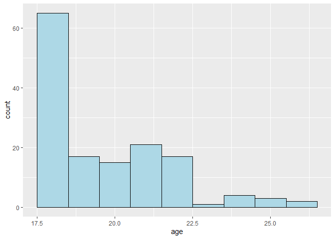<!-- -->

``` r
ggplot(data, aes(x = age)) +
  geom_density(fill = "lightblue", alpha = 0.5)
```

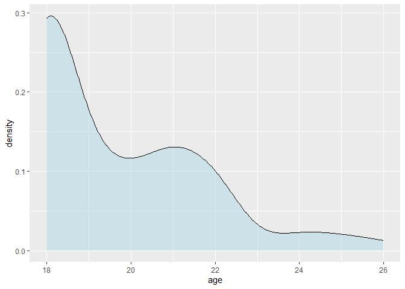<!-- -->

``` r
ggplot(data, aes(x = age)) +
  geom_boxplot()
```

<!-- -->

To compare the frequencies of discrete variables, you can use a bar
plot.

``` r
ggplot(data, aes(x = additional_work)) +
  geom_bar()
```

<!-- -->

# Bivariate plots

You can plot two continuous variables with a scatter plot. For example,
you can plot the relationship between age and grade by specifying these
variables as the x and y aesthetics:

``` r
ggplot(data, aes(x = age, y = grade)) +
  geom_point()
```

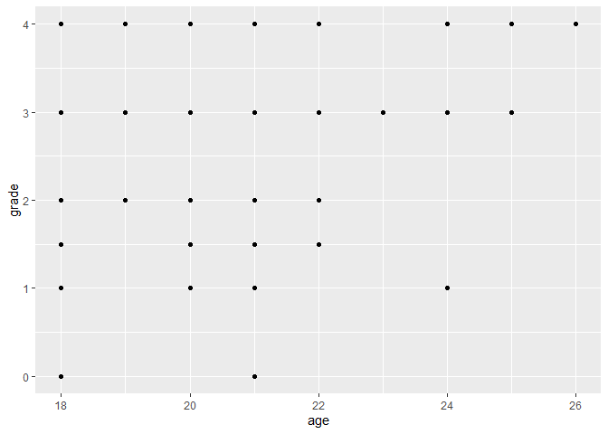<!-- -->

Fitting a smooth curve or a linear regression line to the scatter plot
can help you see the overall trend in the data.

``` r
ggplot(data, aes(x = age, y = grade)) +
  geom_point() + 
  geom_smooth()
```

<!-- -->

``` r
ggplot(data, aes(x = age, y = grade)) +
  geom_point() + 
  # method = "lm" fits a linear model, se = FALSE removes the confidence interval
  geom_smooth(method = "lm", se = FALSE)
```

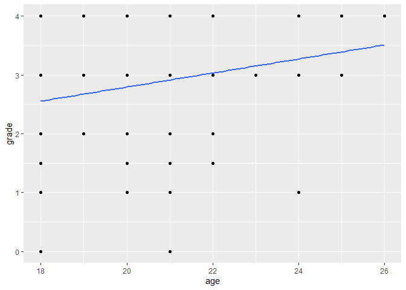<!-- -->

If points overlap a lot, it might be useful to add some jitter,
i.e. random noise to distribute the points, by using `geom_jitter()`
instead of `geom_point()`.

``` r
ggplot(data, aes(x = age, y = grade)) +
  geom_jitter() + 
  geom_smooth(method = "lm", se = FALSE)
```

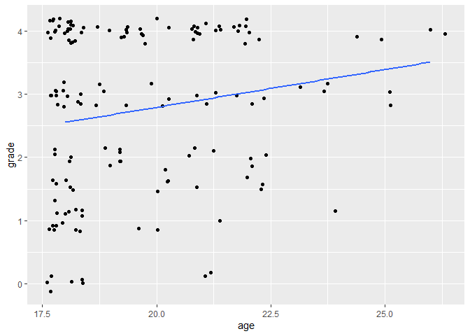<!-- -->

Categorical variables can be used to show the distribution of continuous
variables by group. You can put a categorical variable on one of the
axes, or use it on another aesthetic, such as the fill or color. Note
that if a variable determines the fill, the color, and the shape of the
points, that has to be specified inside an `aes()` function, while if
the characteristic is pre-defined, then it goes outside the `aes()`
function. Also note that if you specify aesthetics in the main
`ggplot()` function, then they apply to all geoms, while if you specify
them in a `geom_...()` function, they apply only to that geom.

``` r
ggplot(data, aes(x = grade, y = additional_work)) +
  geom_boxplot()
```

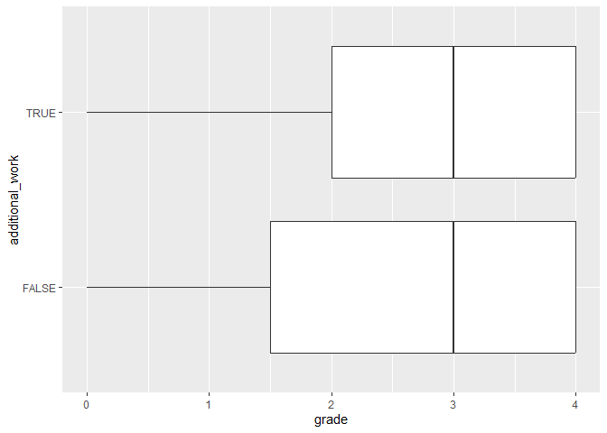<!-- -->

``` r
ggplot(data) +
  geom_density(aes(x = grade, fill = additional_work), alpha = 0.5)
```

<!-- -->

To plot two categorical variables, you can use a bar plot with an extra
grouping argument. The next plot shows the number of students who do the
class readings or not, and for each group we know whether they work take
notes in class or not.

``` r
ggplot(data, aes(x = reading, fill = notes)) +
  geom_bar()
```

<!-- -->

``` r
# to put the bars next to each other instead of on top, specify the position
ggplot(data, aes(x = reading, fill = notes)) +
  geom_bar(position = "dodge")
```

<!-- -->

Alternatively, you can use the `count()` function to count the number of
observations in each possible combination of the two variables, and plot
the results on a heatmap where lighter colors correspond to larger
frequencies. To make the plot more readable, you can add the observed
counts to the tiles with a `geom_text()` function, which requires an
extra aesthetic `label`.

``` r
data |> 
  count(reading, notes) |> 
  ggplot(aes(x = reading, y = notes, fill = n)) +
  geom_tile(color = "white") +
  geom_text(aes(label = n), color = "white")
```

<!-- -->

# Customizing plot features

The two largest advantages of `ggplot2` are the ability to layer
multiple geoms on top of each other and the ability to extensively
customize every plot by adding additional plot elements.

You can make the plot more informative by adding titles and axis labels.

``` r
ggplot(data, aes(x = grade, y = reading)) +
  geom_boxplot() +
  labs(title = "Grade distribution based on whether the student does the reading",
       x = "Grade",
       y = "Student does the reading?")
```

<!-- -->

You can also change the appearance of the plot by changing the theme,
the color palette, and the axis scales.

``` r
ggplot(data, aes(x = grade, y = reading)) +
  geom_boxplot() +
  labs(title = "Grade distribution based on whether the student does the reading",
       x = "Grade",
       y = "Student does the reading?") +
  # define the axis tick positions on the continuous x axis
  scale_x_continuous(breaks = seq(0, 4, 0.5)) +
  # relabel the items on the discrete y axis
  scale_y_discrete(breaks = c(FALSE, TRUE), labels = c("No", "Yes")) +
  # change the theme to a pre-defined theme
  theme_light()
```

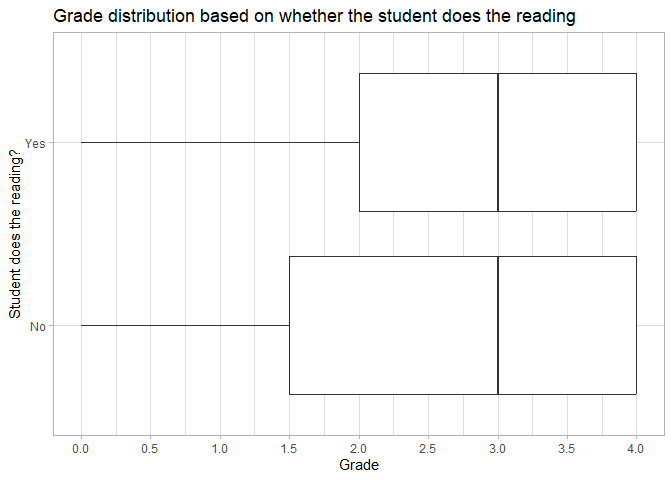<!-- -->

``` r
ggplot(data, aes(x = reading, fill = notes)) +
  geom_bar() +
  labs(x = "Student does the reading?",
       y = "Number of students",
       fill = "Student takes notes?") +
  # change the colors to a palette from the RColorBrewer package
  scale_fill_brewer(palette = "Set1") +
  theme_light()
```

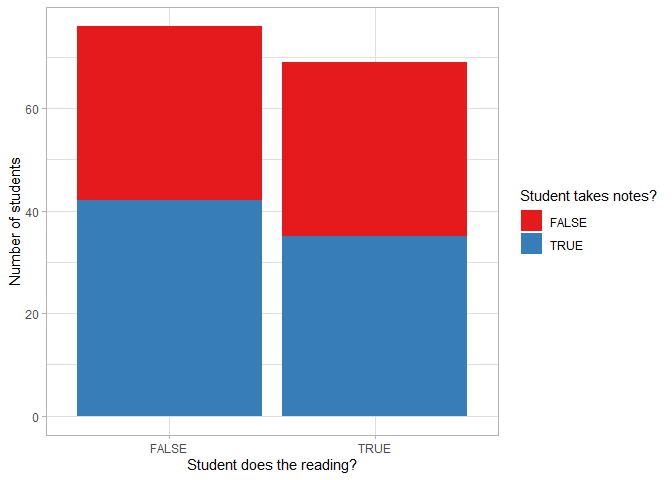<!-- -->

You can change the theme in your entire R session by using the
`theme_set()` function. In that case, you don’t need to include the
`theme_...()` function in every plot. For example:

``` r
theme_set(theme_bw()) # change the theme of all future plots to a black-and-white theme
```

# More advanced features

The [R Graph Gallery](https://r-graph-gallery.com/) provides a long list
of common plot types, and so do Chapters 4 and 5 of [*Modern Data
Visualization with R*](https://rkabacoff.github.io/datavis/index.html).
Both resources group geoms by the type of variable(s) plotted.

You can use multiple datasets inside the same plot by specifying a new
dataset (such as a filtered version of the original dataset) in the
`data` argument of a `geom_...()` function. This feature can be useful
to highlight particular observations, such as the location of the one
student who doesn’t receive a scholarship on the age-grade scatterplot.

``` r
ggplot(data, aes(x = age, y = grade)) +
  geom_point() +
  geom_point(data = filter(data, is.na(scholarship)), color = "red") +
  labs(caption = "The red point corresponds to the student without a scholarship")
```

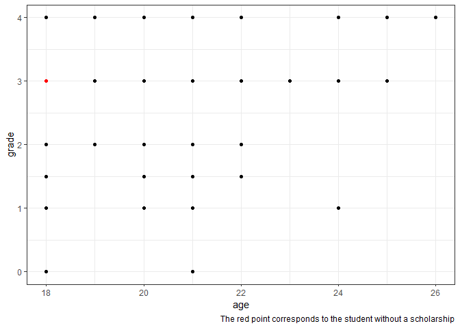<!-- -->

# Multiple plots

Often you would like to present multiple plots side-by-side: maybe show
how the relationship between variables differs depending on some
groupings of observations (and putting all observations on a single plot
looks too cluttered), or compare how different outcome variables react
to changes in an explanatory variable. The two main ways to nicely
arrange plots are

- creating a single plot with multiple panels, known as facets;
- creating multiple independent plots, and arranging them into one
  figure afterwards.

## Using facets

By specifying a grouping variable along which to facet, you can create a
separate plot for each value of your facet variable. You can create
faceted plots by adding `facet_wrap()` to your `ggplot` object, and
specify the faceting variable with a tilde (`~`). You can also specify
additional arguments such as whether to allow the axis limits to vary
between panels. Only use variables with relatively few unique values as
your facet dimension, otherwise R will attempt to create far too many
plots, which takes a long time and might even crash your R session.

``` r
ggplot(data, aes(x = age)) +
  geom_histogram(binwidth = 1) +
  # Create separate plots based on whether the student does the reading
  facet_wrap(~reading)
```

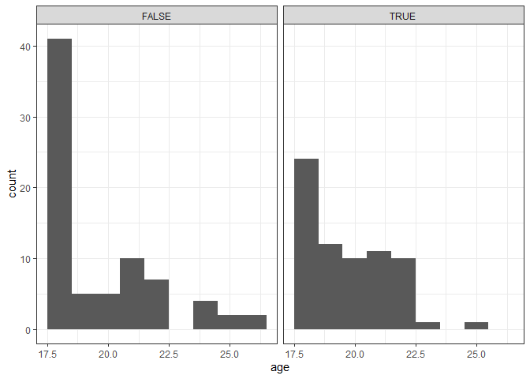<!-- -->

``` r
ggplot(data, aes(x = age)) +
  geom_histogram(binwidth = 1) +
  # Create separate plots per season, arrange all plots in one column, let all scales vary
  facet_wrap(~reading, ncol = 1, scales = "free")
```

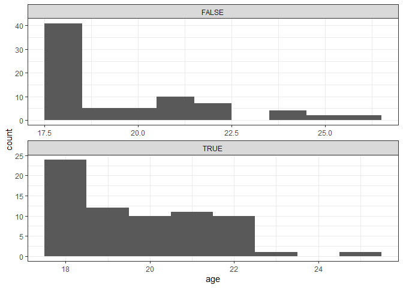<!-- -->

If you would like to group your data based on two variables, you can use
`facet_grid()`, separating your two variables with a tilde. In this
example, let’s rename the variable values to make it clear which group
each plot represents.

``` r
data |> 
  mutate(reading = ifelse(reading, "Reading", "No reading"),
         notes = ifelse(notes, "Notes", "No notes")) |>
  ggplot(aes(x = age)) +
  geom_histogram(binwidth = 1) +
  # Create separate plots based on whether the student does the reading and takes notes
  facet_grid(~reading~notes)
```

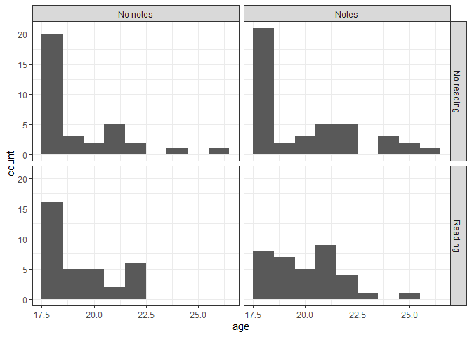<!-- -->

## Combining independent plots with `patchwork`

In order to nicely arrange separate plots and same them as a single
file, you can use the `patchwork packages`. First you need to save each
of your plots into an R object (here `p1`, `p2`, `p3`), then use `+`
signs to combine the plots horizontally, and `/` signs to combine them
vertically. You can make these layouts as complex as you want to by
using parentheses to group rows. Alternatively, you can specify custom
layout options, including additional options such as whether to repeat
or collect legends, by adding a `plot_layout()` function to the plot
objects.

``` r
# install.packages("patchwork")
library(patchwork)
# Create and save plots of grades per reading, notetakings, and listening

p1 <- ggplot(data, aes(x = grade, fill = reading)) +
  geom_density(alpha = 0.5) + 
  # place the legend inside the plot at the defined coordinates (0-1 scale)
  theme(legend.position = c(0.25, 0.85))

p2 <- ggplot(data, aes(x = grade, fill = notes)) +
  geom_density(alpha = 0.5) + 
  theme(legend.position = c(0.25, 0.85))

p3 <- ggplot(data, aes(x = grade, fill = listening)) +
  geom_density(alpha = 0.5) + 
  theme(legend.position = c(0.25, 0.85))

# Combine the plots horizontally
p1 + p2 + p3
```

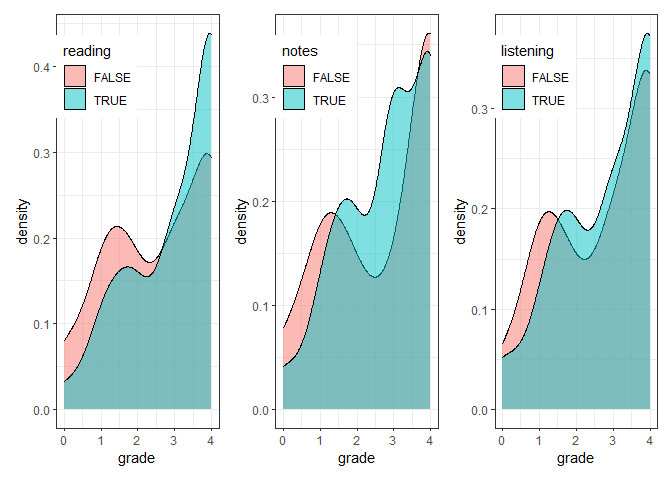<!-- -->

``` r
# Combine temp and ozone vertically
p1 / p2 / p3
```

<!-- -->

``` r
# Combine the plots vertically with plot_layout
p1 + p2 + p3 + plot_layout(ncol = 1)
```

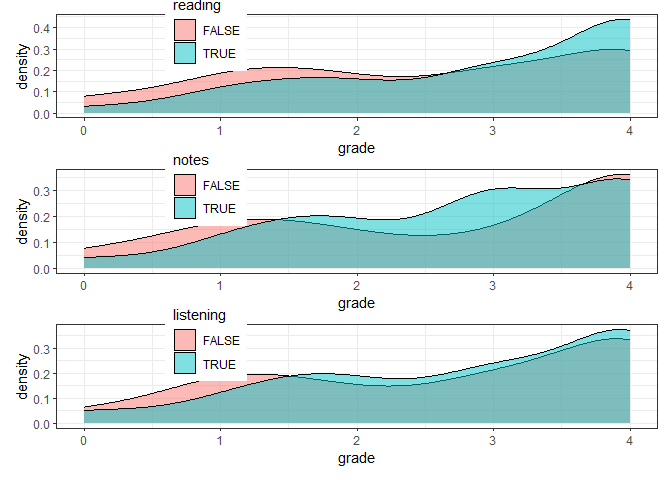<!-- -->

# Saving plots

You can save `ggplot` objects to use outside of the R environment with
the `ggsave` function. You can specify an existing `ggplot` object as
the first argument, but by default `ggsave()` saves the last plot
displayed in your Plots panel. You always need to specify the file path
of the saved plot, including the preferred file format (e.g. .png, .jpg,
.pdf). You can adjust the plot size with the `scale` argument or by
specifying the height and width in your preferred units (the default
units are inches).

``` r
ggplot(data, aes(x = grade, y = age)) + 
  geom_point()

# Save last plot
ggsave("figures/plot1.png", scale = 1.5)

p <- ggplot(data, aes(x = grade, y = age)) + 
  geom_point()

# Save plot saved to the Environment
ggsave(p, "figures/plot2.png", height = 10, width = 15, units = "cm")
```

# Go to

- [Introduction to R](intro)
- [Finding and importing data](import)
- [Data cleaning with `dplyr`](clean)
- [Summary statistics](summary)
- [Hypothesis testing / modelling](tests)
