- [Introduction](#introduction)
- [Data](#data)
- [Plot 1:](#plot-1)
- [Plot 2:](#plot-2)
- [Plot 3:](#plot-3)
- [Plot 4:](#plot-4)
- [Plot 5:](#plot-5)
- [Homework assignments](#homework-assignments)
  - [Assignment 1](#assignment-1)
  - [Assignment 2](#assignment-2)
  - [Assignment 3](#assignment-3)

## Introduction

In this workshop, we will expand on some of the basic functions, use
tidyverse more and introduce some archaeology specific functions. It
will follow the flow of a more typical data analysis workflow. We will
again work with data about lithics from the Jerimalai rockshelter in
East-Timor. This workshop has been inspired by the ‘tidyverse for
archaeologists’ workshop by Professor Ben Marwick.

Some of the code will be evaluated here, but some will not so please
copy and paste the code into your own script and run it there.

Load the `tidyverse` and `rio` packages.

``` r
library(tidyverse)
library(rio)
```

## Data

Remember that the data comes in the form of an excel file from a link,
and that we load it in using the `import` function from the `rio`
package.

``` r
data <- import("https://bit.ly/j_data_xlsx", setclass = "tbl_df")
```

Let’s have a more detailed look at the data.

``` r
View(data)
summary(data)
```

This is a lot of information, and not that useful for us, as it is more
useful when dealing with true numerical data, something that happens
more rarely in archaeological data science than in other disciplines.

Let’s try out some other new functions to look at a data frame that
might be more useful in this case.

``` r
names(data)
```

    ##  [1] "Site"       "Square"     "Spit"       "Group"      "Artno"     
    ##  [6] "Material"   "Colour"     "Weight"     "Length"     "Artclas"   
    ## [11] "Cortex"     "Cortype"    "Initiat"    "Breaks"     "Noseg"     
    ## [16] "Platwid"    "Plat"       "Focal"      "Overhang"   "NoDS"      
    ## [21] "NoPS"       "Rtch"       "Plat_2"     "Focal_2"    "Overhang_2"
    ## [26] "NoDS_2"     "NoPS_2"     "Rtch_2"     "RetOri"     "Retype"    
    ## [31] "Retloc"     "Retlen"     "Retdep"     "Portion"    "Heat"      
    ## [36] "EdgeDam"    "Weathering" "Corerot"    "RetScNo"    "Term"      
    ## [41] "Janus"      "Recycled"   "Redirect"   "Width"      "Thick"     
    ## [46] "Platthic"   "area"       "elongation"

``` r
head(data)
```

    ## # A tibble: 6 × 48
    ##   Site  Square  Spit Group Artno Material Colour   Weight Length Artclas Cortex
    ##   <chr> <chr>  <dbl> <dbl> <dbl> <chr>    <chr>     <dbl>  <dbl> <chr>    <dbl>
    ## 1 J     B          1     1     1 Chert    Brown      1.83  22.0  Flake        0
    ## 2 J     B          1     1     2 Chert    Yellow     0.61  14.6  RetF         0
    ## 3 J     B          1     1     3 Chert    Dk Grey    3.81  29.6  Core         0
    ## 4 J     B          1     1     4 Chert    Grey       0.13   5.83 RetFrag      0
    ## 5 J     B          1     1     5 Chert    Grey       0.05   7.07 Flake        0
    ## 6 J     B          1     1     6 Chert    Lt Brown   0.58  11.1  Core        NA
    ## # ℹ 37 more variables: Cortype <chr>, Initiat <chr>, Breaks <chr>, Noseg <dbl>,
    ## #   Platwid <dbl>, Plat <chr>, Focal <lgl>, Overhang <chr>, NoDS <dbl>,
    ## #   NoPS <dbl>, Rtch <chr>, Plat_2 <chr>, Focal_2 <lgl>, Overhang_2 <chr>,
    ## #   NoDS_2 <dbl>, NoPS_2 <dbl>, Rtch_2 <chr>, RetOri <chr>, Retype <chr>,
    ## #   Retloc <chr>, Retlen <dbl>, Retdep <dbl>, Portion <chr>, Heat <dbl>,
    ## #   EdgeDam <dbl>, Weathering <dbl>, Corerot <dbl>, RetScNo <dbl>, Term <chr>,
    ## #   Janus <lgl>, Recycled <lgl>, Redirect <lgl>, Width <dbl>, Thick <dbl>, …

We will select the `Square`, `Spit`, `Material`, `Weight`, `Thick` and
`Colour` columns. Note that we can select multiple columns in one go
using the comma.

``` r
data |> 
  select(Square, Spit, Material, Weight, Thick, Colour)
```

## Plot 1:

We now want to get into plotting our data. For this we are again only
interested in the `Square`, `Spit`, `Material`, `Weight` and `Thick`
columns.

Wile we work with data, we often change our data sets quite a lot
depending on what we want to investigate, so it is necessary to cache
our data sets under different names. That way we always keep track of
which data is stored where, which is particularly important in
archaeology given the vastly different types of analysis we can conduct
with our data.

``` r
data_plotting <- data |> 
  select(Square, Spit, Material, Weight, Thick)

print(data_plotting)
```

    ## # A tibble: 9,752 × 5
    ##    Square  Spit Material Weight Thick
    ##    <chr>  <dbl> <chr>     <dbl> <dbl>
    ##  1 B          1 Chert      1.83  3.34
    ##  2 B          1 Chert      0.61  2.74
    ##  3 B          1 Chert      3.81  7.25
    ##  4 B          1 Chert      0.13  2.05
    ##  5 B          1 Chert      0.05  1.13
    ##  6 B          1 Chert      0.58  4.79
    ##  7 B          1 Chert      0.03  1.16
    ##  8 B          1 Chert      0.02  1.09
    ##  9 B          1 Chert      0.21  3.91
    ## 10 B          1 Chert      0.25  3.13
    ## # ℹ 9,742 more rows

We can now create a histogram of the `Weight` column. This will show how
many artefacts have a certain weight. Creating histograms of a variable
is a common practice in archaeology, as it provides a quick visual
overview of patterns. We can do this using the important `ggplot()`
function. This function takes a tibble, and can then create all kinds of
plots. `ggplot()` works with layers.

We can add these layers with a + sign. The base command is `ggplot()`.
This creates a white canvas, and you can add information by adding
layers.

``` r
ggplot(data = data_plotting)
```

<!-- -->

Since we have not told ggplot how to display the data yet, we still have
a blank canvas.

As we want to make a histogram, we only need to specify the x axis,
which is done by the `aes()` function within the `mapping` argument.

``` r
ggplot(data = data_plotting, mapping = aes(x = Weight))
```

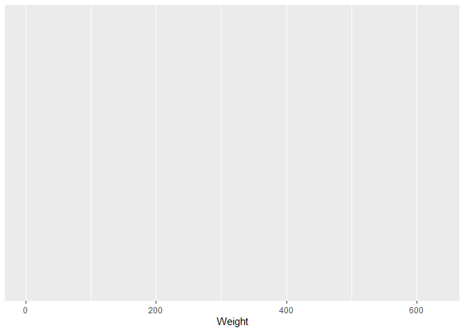<!-- -->

We have now filled in the two most important `arguments` from
`ggplot()`, `data` and `mapping`. Since these arguments are always the
first two arguments in the `ggplot()` function, we often do not
explicitly name them to save us some time.

However, we still do not see a histogram, so now we need to add a layer
that actually tells ggplot that we want the plot to be a histogram.

The layers that define the type of plot are known as `geoms()`. There
are many different geoms, but we want to create a histogram, so we will
use the `geom_histogram()` function.

``` r
ggplot(data_plotting, aes(x = Weight)) +
  geom_histogram()
```

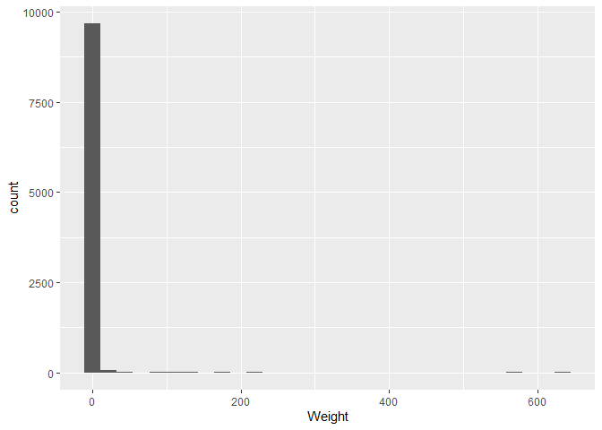<!-- -->

We can see our data on the plot!

However, there appear to be some weights that are very large and cause
the graph to stretch to 600, whilst most are close to zero. If we change
the x-axis scale to a logaritmic scale, we can see the distribution
better. We edit the scale by adding a new layer to our plot, in our case
in the form of the `scale_x_log10()` function.

A logarithm is a mathematical function that increases slowly at first,
and then faster and faster. This is useful for data that has a large
range (something you will be encountering more often with archaeological
data), as it compresses the data and makes it easier to see the
distribution. This specific logarithm is the base 10 logarithm, which
means that 10 is raised to the power of the number on the x axis. For
example, 10^2 = 100, so the number 2 would be at the position 100 on the
x axis.

``` r
ggplot(data_plotting, aes(x = Weight)) +
  geom_histogram() +
  scale_x_log10()
```

<!-- -->

Now that it finally looks like an actual histogram, we can give it a
last touch by changing the theme of the plot. This is purely an optical
change and there are many themes available, but we will just use the
`theme_bw()` theme for now, which we add like any other layer to our
`ggplot()`.

``` r
ggplot(data_plotting, aes(x = Weight)) +
  geom_histogram() +
  scale_x_log10() +
  theme_bw()
```

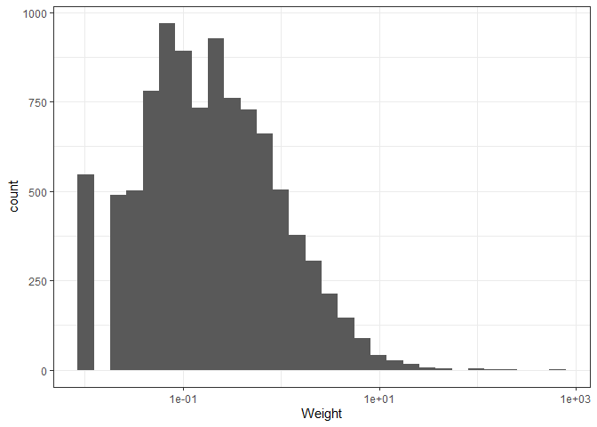<!-- -->

## Plot 2:

for our next plot, we only want to keep rows that have the “A” value for
the `Square` column. We can do this using the `filter()` function. Keep
in mind that “A” is a string, so we need to use quotation marks and two
equal signs.

``` r
data_plotting_2 <- data |> 
  filter(Square == "A")
```

Now, from these rows we only want light objects, lets say with a
`Weight` less than 10. We can do this by adding another condition to our
`filter()` with the `&` (“and”) operator.

``` r
data_plotting_2 |>
  filter(Square == "A" & Weight < 10)
```

    ## # A tibble: 4,416 × 48
    ##    Site  Square  Spit Group Artno Material Colour Weight Length Artclas  Cortex
    ##    <chr> <chr>  <dbl> <dbl> <dbl> <chr>    <chr>   <dbl>  <dbl> <chr>     <dbl>
    ##  1 J     A          1    NA  4332 Chert    Peach    1.74  18.3  Flake         0
    ##  2 J     A          1    NA  4333 Chert    Grey     1.64  20.5  Flake        10
    ##  3 J     A          1    NA  4334 Obsidian Black    0.12   9.53 Flake         0
    ##  4 J     A          1    NA  4335 Chert    Grey     2.12  17.6  Flake         0
    ##  5 J     A          1    NA  4336 Chert    Pink     2.25  19.3  RetF          0
    ##  6 J     A          1    NA  4337 Chert    Orange   4.88  25.1  Non-diag      0
    ##  7 J     A          1    NA  4338 Chert    White    8.95  21.0  Flake         0
    ##  8 J     A          1    NA  4339 Chert    Brown    3.02  20.1  Flake-b       0
    ##  9 J     A          1    NA  4340 Chert    Grey     2.71  19.5  Flake         0
    ## 10 J     A          1    NA  4341 Chert    Grey     1.31   9.36 Flake         0
    ## # ℹ 4,406 more rows
    ## # ℹ 37 more variables: Cortype <chr>, Initiat <chr>, Breaks <chr>, Noseg <dbl>,
    ## #   Platwid <dbl>, Plat <chr>, Focal <lgl>, Overhang <chr>, NoDS <dbl>,
    ## #   NoPS <dbl>, Rtch <chr>, Plat_2 <chr>, Focal_2 <lgl>, Overhang_2 <chr>,
    ## #   NoDS_2 <dbl>, NoPS_2 <dbl>, Rtch_2 <chr>, RetOri <chr>, Retype <chr>,
    ## #   Retloc <chr>, Retlen <dbl>, Retdep <dbl>, Portion <chr>, Heat <dbl>,
    ## #   EdgeDam <dbl>, Weathering <dbl>, Corerot <dbl>, RetScNo <dbl>, …

`&` is a very useful logical operator. Another very common logical
operator is `|` (Shift + /), which stands for “or”. If we wanted to
include all observations that have an “A” or “a” value in the `Square`
column for example, we could write the following code:

``` r
data_example_or <- data |>
  filter(Square == "A" | Square == "a")
```

For now we will continue and add to our previous filters though.

We also want a thickness between 0.2 and 20. We can either do this by
adding two additional conditions, or by using the `between()` function.

``` r
data_plotting_2 |> 
  filter(Square == "A" & Weight < 10 & Thick > 0.2 & Thick < 20)
```

    ## # A tibble: 4,390 × 48
    ##    Site  Square  Spit Group Artno Material Colour Weight Length Artclas  Cortex
    ##    <chr> <chr>  <dbl> <dbl> <dbl> <chr>    <chr>   <dbl>  <dbl> <chr>     <dbl>
    ##  1 J     A          1    NA  4332 Chert    Peach    1.74  18.3  Flake         0
    ##  2 J     A          1    NA  4333 Chert    Grey     1.64  20.5  Flake        10
    ##  3 J     A          1    NA  4334 Obsidian Black    0.12   9.53 Flake         0
    ##  4 J     A          1    NA  4335 Chert    Grey     2.12  17.6  Flake         0
    ##  5 J     A          1    NA  4336 Chert    Pink     2.25  19.3  RetF          0
    ##  6 J     A          1    NA  4337 Chert    Orange   4.88  25.1  Non-diag      0
    ##  7 J     A          1    NA  4338 Chert    White    8.95  21.0  Flake         0
    ##  8 J     A          1    NA  4339 Chert    Brown    3.02  20.1  Flake-b       0
    ##  9 J     A          1    NA  4340 Chert    Grey     2.71  19.5  Flake         0
    ## 10 J     A          1    NA  4341 Chert    Grey     1.31   9.36 Flake         0
    ## # ℹ 4,380 more rows
    ## # ℹ 37 more variables: Cortype <chr>, Initiat <chr>, Breaks <chr>, Noseg <dbl>,
    ## #   Platwid <dbl>, Plat <chr>, Focal <lgl>, Overhang <chr>, NoDS <dbl>,
    ## #   NoPS <dbl>, Rtch <chr>, Plat_2 <chr>, Focal_2 <lgl>, Overhang_2 <chr>,
    ## #   NoDS_2 <dbl>, NoPS_2 <dbl>, Rtch_2 <chr>, RetOri <chr>, Retype <chr>,
    ## #   Retloc <chr>, Retlen <dbl>, Retdep <dbl>, Portion <chr>, Heat <dbl>,
    ## #   EdgeDam <dbl>, Weathering <dbl>, Corerot <dbl>, RetScNo <dbl>, …

``` r
data_plotting_2 |> 
  filter(Square == "A" & Weight < 10 & between(Thick, 0.2, 20))
```

    ## # A tibble: 4,392 × 48
    ##    Site  Square  Spit Group Artno Material Colour Weight Length Artclas  Cortex
    ##    <chr> <chr>  <dbl> <dbl> <dbl> <chr>    <chr>   <dbl>  <dbl> <chr>     <dbl>
    ##  1 J     A          1    NA  4332 Chert    Peach    1.74  18.3  Flake         0
    ##  2 J     A          1    NA  4333 Chert    Grey     1.64  20.5  Flake        10
    ##  3 J     A          1    NA  4334 Obsidian Black    0.12   9.53 Flake         0
    ##  4 J     A          1    NA  4335 Chert    Grey     2.12  17.6  Flake         0
    ##  5 J     A          1    NA  4336 Chert    Pink     2.25  19.3  RetF          0
    ##  6 J     A          1    NA  4337 Chert    Orange   4.88  25.1  Non-diag      0
    ##  7 J     A          1    NA  4338 Chert    White    8.95  21.0  Flake         0
    ##  8 J     A          1    NA  4339 Chert    Brown    3.02  20.1  Flake-b       0
    ##  9 J     A          1    NA  4340 Chert    Grey     2.71  19.5  Flake         0
    ## 10 J     A          1    NA  4341 Chert    Grey     1.31   9.36 Flake         0
    ## # ℹ 4,382 more rows
    ## # ℹ 37 more variables: Cortype <chr>, Initiat <chr>, Breaks <chr>, Noseg <dbl>,
    ## #   Platwid <dbl>, Plat <chr>, Focal <lgl>, Overhang <chr>, NoDS <dbl>,
    ## #   NoPS <dbl>, Rtch <chr>, Plat_2 <chr>, Focal_2 <lgl>, Overhang_2 <chr>,
    ## #   NoDS_2 <dbl>, NoPS_2 <dbl>, Rtch_2 <chr>, RetOri <chr>, Retype <chr>,
    ## #   Retloc <chr>, Retlen <dbl>, Retdep <dbl>, Portion <chr>, Heat <dbl>,
    ## #   EdgeDam <dbl>, Weathering <dbl>, Corerot <dbl>, RetScNo <dbl>, …

We also don’t want rows that have `NA` values in the `Material` column.

``` r
data_plotting_2 <- data_plotting_2|> 
  filter(Square == "A" & Weight < 10 & between(Thick, 0.2, 20) & !is.na(Material))
```

We now want to create a scatterplot of the `Weight` and `Thick` columns.
Scatterplots can be used in archaeology to examine correlations between
two variable of an object, for example the depth from which it was
excavated and the time it can be dated to. In that sense it also allows
us to visually find outliers that might infer an unusual activity or
previously unexplained pattern.

Create the empty plot, now define both `x` and `y`.

``` r
 ggplot(data_plotting_2, aes(x = Weight, y = Thick))
```

<!-- -->

Add the `geom_point()` layer that creates a scatterplot.

``` r
 ggplot(data_plotting_2, aes(x = Weight, y = Thick)) +
  geom_point()
```

<!-- -->

It may again be useful to change the x axis to a logarithmic scale.

``` r
 ggplot(data_plotting_2, aes(x = Weight, y = Thick)) +
  geom_point() +
  scale_x_log10()
```

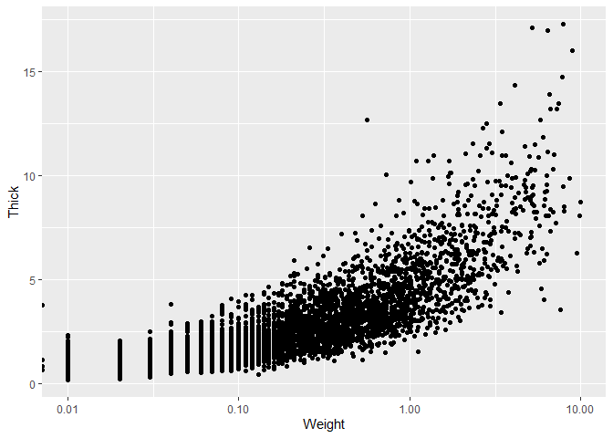<!-- -->

We can also do the same for the y axis this time.

``` r
 ggplot(data_plotting_2, aes(x = Weight, y = Thick)) +
  geom_point() +
  scale_x_log10() +
  scale_y_log10()
```

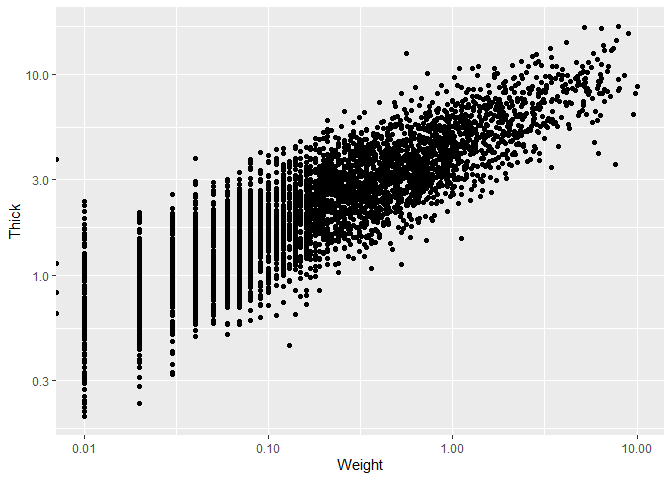<!-- -->

We now set the theme, as well as changing the axis labels, for which we
use the `labs()` function that has all types of useful arguments to
change the labels of our plots.

``` r
 ggplot(data_plotting_2, aes(x = Weight, y = Thick)) +
  geom_point() +
  scale_x_log10() +
  scale_y_log10() +
  theme_bw() +
  labs(x = "Weight (g)", y = "Thickness (mm)")
```

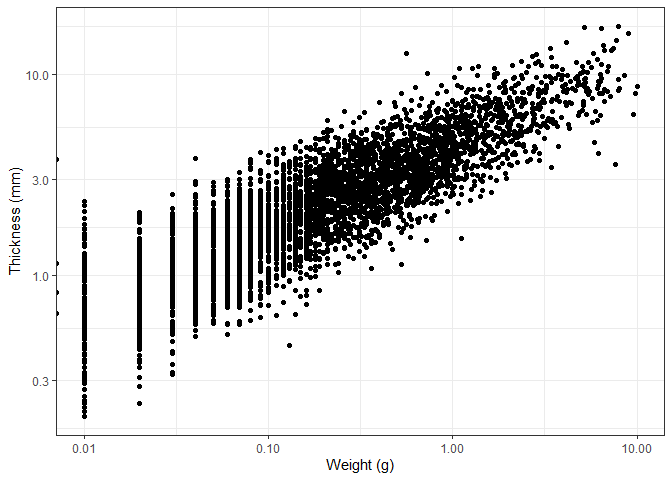<!-- -->

We can also add a colour to the points based on the material the object
is made of. We do this by adding the `colour` argument to the `aes()`
function and telling it to base the color on the `Material` column.

``` r
 ggplot(data_plotting_2, aes(x = Weight, y = Thick, colour = Material)) +
  geom_point() +
  scale_x_log10() +
  scale_y_log10() +
  theme_bw() +
  labs(x = "Weight (g)", y = "Thickness (mm)")
```

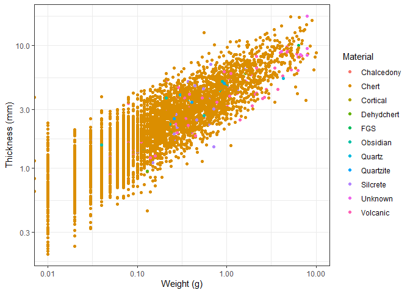<!-- -->

Using the `theme()` function (not to be mixed up with the different
`themes` functions), we can change the position of the legend. We need
to specify the x and y coordinates of the legend. This uses a coordinate
system between 0 and 1, so 0.5 is in the middle. When you create your
own graphs, finding the right position might take some try and error.

``` r
ggplot(data_plotting_2, aes(x = Weight, y = Thick, colour = Material)) +
  geom_point() +
  scale_x_log10() +
  scale_y_log10() +
  theme_bw() +
  labs(x = "Weight (g)", y = "Thickness (mm)") +
  theme(legend.position = c(0.85, 0.3))
```

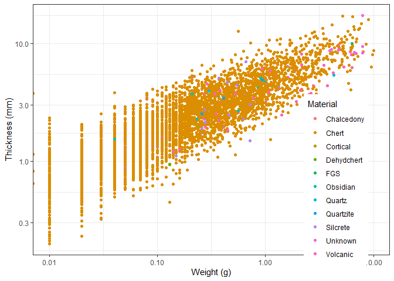<!-- -->

## Plot 3:

Our goal now is to make a boxplot of a `plat_area` column, grouped by
the `Material` column. Boxplots are useful to use in archaeology to
estimate size distributions by a category like we are doing it here.
Lets get the data first. We need to create the `plat_area` column first.

``` r
data_plat_area <- data |> 
  mutate(plat_area = Platwid * Platthic)
```

Now we only keep materials that have more than 5 objects and remove `NA`
values. To create subgroups within a data frame use the `group_by()`
function that requires a column as input based on which groups will be
created.

``` r
data_plotting_3 <- data_plat_area |> 
  group_by(Material) |>
  filter(n() > 5 & !is.na(Material))
```

Now create the plot using the `geom_boxplot()` function. We leave the
code for a homework assignment.

<!-- -->

## Plot 4:

We now want to create a plot that shows the number of objects per
material. First get the data.

To get the number of objects we make use of the `count()` function. The
count function counts the number of unique values in a column and
returns a summary table with the values and their counts.

``` r
data_plotting_4 <- data_plotting_3 |> 
  group_by(Material) |> 
  count()
```

Now create the plot using the `geom_col()` function.

``` r
ggplot(data = data_plotting_4) +  
  aes(x = Material,  
      y = n) +  
  geom_col() +  
  scale_y_log10() +  
  labs(x = "Raw Material",  
       y =  "Number of Objects") +  
  theme_classic(base_size = 14)
```

<!-- -->

We can change the order of the columns using the `reorder()` function.
We need to specify the column we want to reorder, and the column we want
to order by. In this case, we want to order the `Material` column by the
`n` column to order the columns by height.

``` r
ggplot(data = data_plotting_4) +  
  aes(x = reorder(Material, n),  
      y = n) +  
  geom_col() +  
  scale_y_log10() +  
  labs(x = "Raw Material",  
       y =  "Number of Objects") +  
  theme_classic(base_size = 14)
```

<!-- -->

If we wanted to create a top 5 plot, we would first arrange the data by
the `n` column, and then only keep the top 5 rows. Here we make use of
the `arrange()` function which can rearrange columns. By default,
`arrange()` orders in ascending order, so if we want to arrange in
descending order, we have to add the `desc()` function in the
`arrange()` function.

``` r
data_plotting_4 <- data_plotting_4 |> 
  arrange(desc(n)) |> 
  head(5)

ggplot(data = data_plotting_4, 
       aes(x = reorder(Material, n), y = n)
       ) +
  geom_col() +
  scale_y_log10() +
  labs(x = "Raw Material", y = "Number of Objects") +
  theme_classic(base_size = 14)
```

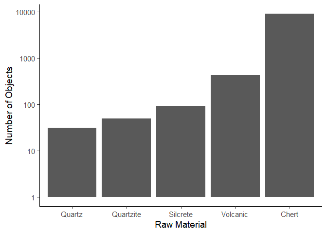<!-- -->

## Plot 5:

Now lets say we want to make a plot of the distributions of length of
each object. We can either manually create each plot by filtering for
each material, or we can simply use the `facet_wrap()` function that
splits a plot up by a column.

``` r
ggplot(data = data_plotting_3) +  
  aes(x = Length) +  
  geom_histogram() +  
  facet_wrap(~Material) +  
  labs(x = "Length (mm)",  
       y =  "Number of Objects") +  
  theme_classic(base_size = 14)
```

<!-- -->

Due to the amount of chert items in the data, this is not very useful,
but with the `scales` argument we can set the `y` axis to be free for
each plot.

``` r
ggplot(data = data_plotting_3) +  
  aes(x = Length) +  
  geom_histogram() +  
  facet_wrap(~Material, scales = "free_y") +  
  labs(x = "Length (mm)",  
       y =  "Number of Objects") +  
  theme_classic(base_size = 14)
```

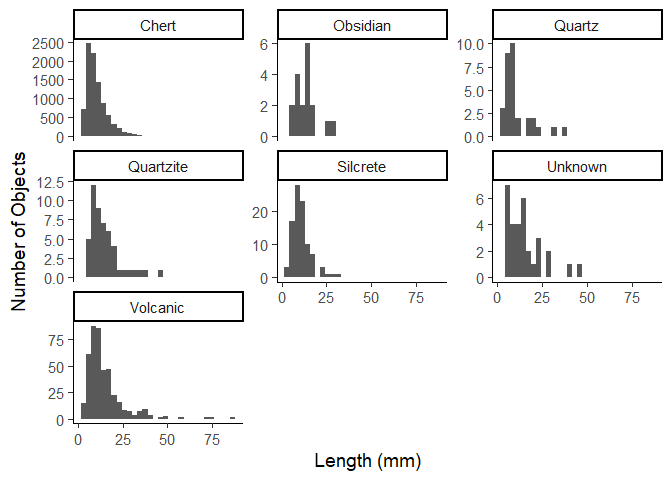<!-- -->

## Homework assignments

For all assignments, consider how your findings allow you to infer
relevant archaeological conclusions from the data.

### Assignment 1

Create the plot below. This is the same plot as we made earlier in the
workshop.

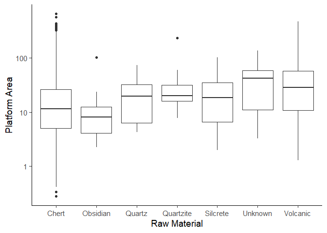<!-- -->

### Assignment 2

Create the plot below of the most common colors. You will need to
perform some data manipulation first.

<!-- -->

### Assignment 3

What is the most common term in the dataset? Create a tibble that
contains the term and the number of times it occurs.
