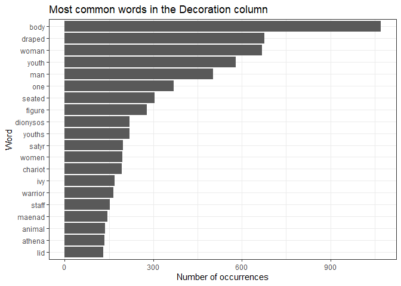
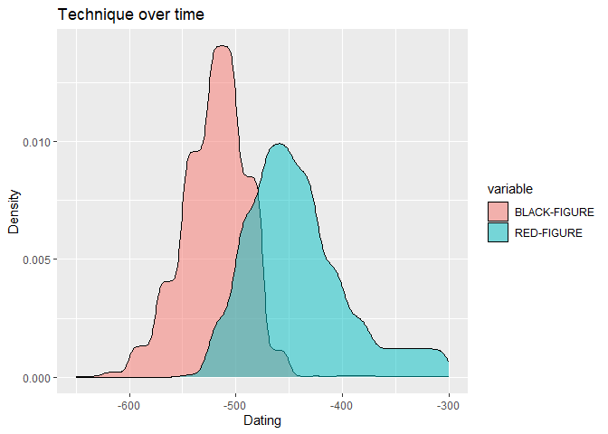
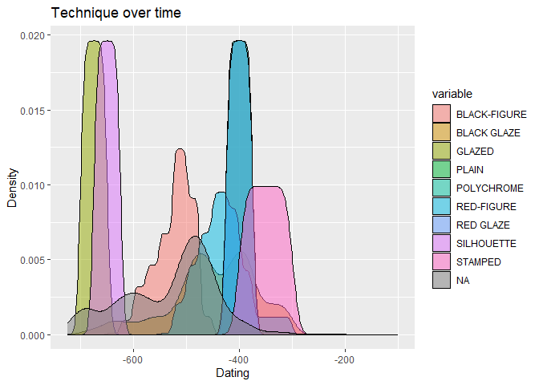

- [Data](#data)
- [Text analysis](#text-analysis)
- [8. The `separate()` function](#the-separate-function)
- [Fuzzy dates](#fuzzy-dates)
- [Homework assignments](#homework-assignments)
  - [Assignment 1](#assignment-1)
  - [Assignment 2](#assignment-2)
  - [Assignment 3](#assignment-3)
  - [Assignment 4](#assignment-4)

## Data

In this workshop, we will work with Beazley Archive data and focus more
on text analysis and fuzzy dates. This workshop is based on work done by
Kalle Valkeakari.

As always, we start by loading `tidyverse`.

``` r
library(tidyverse)
library(rio)
```

We then load the data. We use a new data set that comes from a link and
in the form of a `.csv` file. This file type is a very common file type
for data sets and we can load it in using the `import()` function from
the `rio` package again.

``` r
data <- import("https://github.com/ucrdatacenter/projects/raw/main/AH-ANTQ103/2024h1/Beazley_Archive.csv")
```

We start by looking at the data.

``` r
View(data)
```

After looking at the data, we have decided that we want the first eight
columns and the 10th and 11th column, so we select them using the
`select()` function.

``` r
data_short <- data |> 
  select(URI, Vase_Number, Fabric, Technique, Sub_Technique, Shape_Name, Provenance, Date, Attributed_To, Decoration)
```

Note that we do not always have to write the names of the columns we
want to select, we can also select the names of the columns we would
like to exclude and the `-` sign.

``` r
data_short <- data |> 
  select(-Inscriptions, -Collection_Record, -Publication_Record, -Inscriptions_II, -Measurements, -Volume, -Weight, -Restorations, -Ornament, -Technical_Observations, -Image_Credits, -Pleiades_URI, -Latitude, -Longitude, -LIMC_ID, -LIMC_Web, -British_Museum_Link, -Ure_Museum_Link, -Bryn_Mawr_College_Link, -Nicholson_Collection_Link, -Notes)
```

Although this is obviously more tedious in this example, you will often
be confronted with data sets where removing unwanted columns is quicker
than listing what you would like to keep.

We might want to check if there are multiple entries for the same
object. Luckily there is a Vase Number column, so we can check if there
are multiple entries for the same vase number. We can do this using the
`duplicated()` function. We can then use the `filter()` function to
filter the data to only include the duplicated rows.

``` r
data_short |> 
  filter(duplicated(Vase_Number))
```

Given that the tibble that this returns is empty, we can conclude that
there are no rows with the same vase number.

We can also check if there are any rows with missing data. We can do
this using the `is.na()` function.

``` r
data_short |> 
  filter(is.na(Vase_Number))
```

Given that the tibble that this returns is empty, we can conclude that
there are no rows with a missing vase number.

However, since archaeological data is usually very messy, it is typical
to find columns with many missing values or entries which are duplicated
for no apparent reason. It is therefore very important to check your
data sets for such irregularities and to clean it to the best of your
abilities using the functions you have learned so far before starting
your analysis.

# Text analysis

Now that we know that there are no rows with missing data, and no rows
with the same vase number, we can start looking at the data in more
detail. We are interested in the decorations on the vases, so we will
look at the Decoration column.

``` r
data_short |> 
  select(Decoration)
```

An interesting question could be which words appear most frequently in
the Decoration column, as these would indicate the most common
decorative elements. This insight would help us infer what was
significant to the ancient civilization that crafted the vases, offering
a glimpse into their society.

We can do this using the `unnest_tokens()` function. This function takes
a column of text data, and splits it into individual words. It then
returns a tibble with the words split up into individual rows. The first
argument of the `unnest_tokens()` function is the name of the new
column, which we will name “word”. The second argument is the column
with text data that will be split up into words.

The `unnest_tokens()` function is a part of the `tidytext` package,
which we must download and load before we can use the function.

``` r
install.packages("tidytext")
```

``` r
library(tidytext)
```

``` r
data_words <- data_short |> 
  unnest_tokens(word, Decoration)
```

Lets take a look at the most common words.

``` r
data_words |> 
  count(word) |> 
  arrange(desc(n))
```

We can already see that there are some `NA` values. We can remove these
easily using the `is.na()` and `filter()` functions and the “not”
operator `!`.

``` r
data_words |> 
  filter(!is.na(word)) |> 
  count(word) |> 
  arrange(desc(n))
```

There are still some words that are not interesting for our analysis.
These are called stop words. Base R has a data set installed that lists
a lot of common stop words which we can use to get rid of the
unimportant words.

Lets have a look at the stop words.

``` r
stop_words |> 
  View()
```

Alternatively we could also define our own custom stop words.

``` r
stop_words <- c("a", "and", "with", "an", "or", "the", "of", "to", "in", "for", "on", "at", "from", "by", "about", "as", "into", "like", "through", "after", "over", "between", "out", "against", "during", "without", "before", "under", "around", "among")
```

In the following we will use our own tibble with stop words, because it
is more sensitive to words that may be interesting to us but usually are
not.

We will also make use of the matching operator `%in%`, which is used to
check if elements of one vector are present in another vector. Following
this logic, we can combine it with the not operator `!` and the
`filter()` function to include only those rows from the word column
which are not present in the stop_words vector.

``` r
word_counts <- data_words |>
  filter(!is.na(word)) |>
  filter(!word %in% stop_words) |>
  count(word) |>
  arrange(desc(n))
```

Looking at our data set we can see that we still have the letter “b”. We
may decide to remove all words that are only one letter long. We can do
this using the `filter()` function.

The `str_length()` function returns the number of characters in a
string. We can use this to filter the data.

``` r
word_counts <- word_counts |> 
  filter(str_length(word) > 1) |> 
  print()
```

There are still a lot of words in here. We decide to only look at the
top 20 words. We can do this using the `top_n()` function.

``` r
word_counts_top_20 <- word_counts |> 
  top_n(20, n) |> 
  print()
```

We can then create a plot of these words.

``` r
ggplot(word_counts_top_20, aes(x = reorder(word, n), y = n)) +
  geom_col() +
  coord_flip() +
  xlab("Word") +
  ylab("Number of occurrences") +
  ggtitle("Most common words in the Decoration column") +
  theme_bw()
```

<!-- -->

The prominence of mythological and religious imagery (Dionysos, maenads,
satyrs) aligns with the cultural and religious significance of religion,
particularly the cult of Dionysus in ancient Greece Additionally, the
frequent mention of youths and warriors suggests a focus on themes of
heroism, mythology, and possibly Athenian social ideals. Overall, the
dominance of body and draped figures highlights the stylistic focus on
human representation in this vase art.

# 8. The `separate()` function

For the homework, the `separate()` function is essential. This function
takes a tibble, a column name, a new column name and a separator. It
then splits the column into two (or more) columns, and returns a tibble
with the new columns. Here I give a silly example of how to use this
function. In your homework, it will actually be useful.

If we take a look at the decoration column, we can see that some vases
have an entry that is one word, then a colon and then more words.
Imagine we want to isolate the first word and the words after the colon.
We can do this using the `separate()` function, and by setting the
separator to `:`.

``` r
data_separated_decoration <- data_short |> 
  separate(Decoration, c("Decoration_1", "Decoration_2"), sep = ":")
```

# Fuzzy dates

Usually data for origins of artefacts are given in ranges (e.g. 450-375
BC), since we cannot exactly date an archaeological artifact. Sadly,
computers do not really like this type of “fuzzy” or uncertain time.

There are two ways to deal with this type of data.

The first is quite simple and implies taking the mean of these two
values. However, this can lead to big errors if you do not understand
the limitations to this approach, like picking a single mean year for a
long time frame or loosing the given uncertainty of our dates by
replacing them with an artificial “specific” date.

Let’s look at the underlying technique used for pottery, that is, the
colors of the decorations on the pottery. Then we can ask, how does the
technique change over time?

We can separate the dates into two columns, and then take the mean of
the two columns. We can do this using the `separate()` function.

``` r
data_short_dates <- data_short |> 
  separate(Date, c("Date_start", "Date_end"), sep = " to ")
```

These columns are now character columns. We can convert them to numeric
columns using the `parse_number()` function.

``` r
data_short_dates <- data_short_dates |> 
  mutate(Date_start = parse_number(Date_start), 
         Date_end = parse_number(Date_end))
```

We can then calculate the mean for each row.

``` r
data_short_dates <- data_short_dates |> 
  mutate(Date_mean = (Date_start + Date_end) / 2)
```

We only keep the rows with a black figure or red figure technique, as
this allows for easier comparison with the plot we will make later.

``` r
data_plotting <- data_short_dates |> 
  filter(Technique == "BLACK-FIGURE" | Technique == "RED-FIGURE")
```

We can then create a plot of the technique over time. We use the `fill`
aesthetic to fill the color of the bars according to the color of the
figures.

We will also use the argument `binwidth`, which defines how wide the
columns appear. The argument `position` is set to `dodge` so that the
two types of figures we have are not printed on top of each other.

``` r
ggplot(data_plotting, aes(x = Date_mean, fill = Technique)) +
  geom_histogram(binwidth = 25, position = "dodge")
```

<!-- -->

Our plot shows us that black figures were very popular around in 500
BCE, becoming more regular in the century preceding it, but then getting
almost completely replaced by red figures which were very popular around
400 BCE. We can also see that the total number of vases declined after
500 BCE. The shift from Black-Figure to Red-Figure aligns with artistic
and technological advancements in Athens, particularly during the Late
Archaic and Classical periods. Red-Figure allowed for greater detail and
naturalistic depictions, leading to its dominance in the Classical
period.

This is one way to deal with the dates, which gives us some insights.
However, we can also keep them fuzzy, which, in some scenarios, is the
more accurate approach. For this we use the `datplot` package.

``` r
install.packages("datplot")
```

``` r
library(datplot)
```

In this package, there is already a Beazley dataset, which we will use
from now on. We can load this dataset using the `data()` function.

``` r
data(Beazley)
```

For the type of plot we want to make, we need to have the data in a
specific format, namely ID, Factor, date_min, date_max. The `datplot`
dataset is already in this format. If this would not be the case, you
would first need to bring the data set into this format.

The following code creates a copy of every year it could possibly be,
given the range of dates. We can define the step size, which is the
number of years between each copy.

``` r
result <- datsteps(Beazley, stepsize = 1)
```

It also calculates a weight for each date. This is the inverse of the
number of copies, which means that if there are more copies of a date,
the weight will be lower. By doing this, we account for the
uncertainties of our dates more accurately then simply taking the mean.

We can use this data to plot the technique over time. Note that we
define the weight as the `weight` aesthetic. This means that the weight
will be used to determine the height of our density curve created by
`geom_density`. Also note than the `Technique` column is here called
`variable`.

``` r
ggplot(result, aes(x = DAT_step, fill = variable, weight = weight)) +
  geom_density(alpha = 0.5) +
  labs(x = "Dating", y = "Density") +
  ggtitle("Technique over time")
```

<!-- -->

Compare this graph to our earlier plot, what differences and
similarities can you find?

Which plot do you prefer?

# Homework assignments

## Assignment 1

1)  Create a plot of the most common descriptions of the vases (As we
    did in the tutorial) in a new dataset, but reuse the code we wrote
    in the lecture. Use [this
    dataset](https://www.carc.ox.ac.uk/XDB/ASP/searchOpen.asp?setResultCheckboxes=chkAlbum&chkAlbum=true&windowWidth=1535&windowHeight=689&search=%20%7BAND%7D%20%20%5BProvenance%5D%20GREECE%2C%20ATHENS%2C%20CERAMICUS#aHeader).

2)  Only looking at the 20 most common words in the data set, what can
    you say about the culture and time in which the vases were created?

3)  Compare the results to the results from the lecture. What do you
    notice?

Note that you can also import the data as a `.csv` file from GitHub
using this link:

``` r
"https://github.com/ucrdatacenter/projects/raw/main/AH-ANTQ103/2024h1/Beazley_Archive_2.csv"
```

## Assignment 2

1)  Create a plot of the most common shapes of the pottery in a new
    dataset. Use the first Beazly archive data we loaded in at the
    beginning of this workshop . We are looking just for the main
    shapes, so for example: “CUP FRAGMENT” and “CUP” should be counted
    as the same shape, namely “CUP”. Show the top 10 most frequent
    shapes.

Hint: You will need to split a column and the separator you want to use
is either a comma or a space. You can use this expression to do that
`[, ]`.

2)  Use the code you wrote for 1.1 to create a plot of the most common
    shapes of the pottery in the original dataset. Again, “CUP FRAGMENT”
    and “CUP” (and similar definitions) should be counted as the same
    shape. Adapting the code should be very straightforward.

3)  Using your plot, try to explain why certain shapes are more common
    than others.

## Assignment 3

1)  Create a plot of the technique over time using the first Beazly
    dataset, which includes the fuzzy dates.

2)  Using the plot, compare the most common techniques over time with
    what you would have expected from learning about different
    techniques in class. Are there similarities or differences?

Hint: The dataset you use for the `datsteps` function needs to be in a
specific format.

You can use this code to create a dataset you can use as a starting
point.

``` r
data_short_dates <- data_short |> 
  separate(Date, c("Date_start", "Date_end"), sep = " to ")

data_short_dates <- data_short_dates |> 
  mutate(Date_start = parse_number(Date_start), 
         Date_end = parse_number(Date_end))
```

The plot should look like this:

<!-- -->

## Assignment 4

This is an open assignment. Create a new, original plot that you think
is interesting and report your findings. This could be a text analysis
on a new Beazley dataset, comparing the results to what we found
earlier, or you can perform another time analysis on the Beazley
dataset. You can also use a different dataset and compare your findings.
Lastly, if you can think of another interesting analysis using
archaeological data, you can do that as well. Try making use of the
unique tools that data science offers you to create a plot that lets you
derive something about the culture or time period from which the pottery
stems. While working on this assignment, please be aware that this is
the file you will be asked to work with for the final report.

Some ideas may include, but are not limited to:

- Comparing the provenances of vases from several large museums

- Look at the occurrences of mythological figures on vases

- Compare the shapes of vases for shapes that may be used in every day
  life
