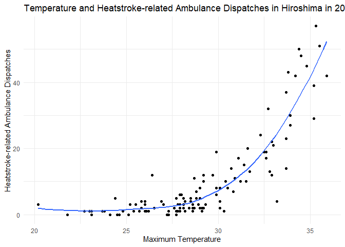
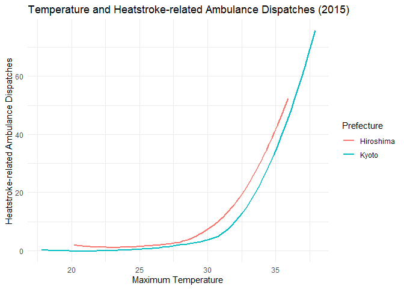

- [Introduction](#introduction)
- [Loading packages](#loading-packages)
- [Importing data sets](#importing-data-sets)
- [Merging the two data sets](#merging-the-two-data-sets)
- [Choosing a prefecture and a year](#choosing-a-prefecture-and-a-year)
- [Creating a plot with Tempmax and
  HSAD](#creating-a-plot-with-tempmax-and-hsad)
- [Creating a plot with Tempmax and
  Date](#creating-a-plot-with-tempmax-and-date)
- [Linear regression analysis](#linear-regression-analysis)
- [Comparing two prefectures](#comparing-two-prefectures)
- [Comparing the days of the week](#comparing-the-days-of-the-week)
- [Creating heat index](#creating-heat-index)
- [Creating a plot with Heat_Index_C and
  HSAD](#creating-a-plot-with-heat_index_c-and-hsad)
- [Linear regression analysis](#linear-regression-analysis-1)

# Introduction

In this encounter, we will investigate and analyze the relationship
between temperature and heatstroke-related ambulance dispatches using
data from Japan. This data offers information about the maximum
temperature measured per day in all 47 prefectures from 2015 to 2019.

# Loading packages

First, we load the `tidyverse` and `rio` packages. Make sure that all
packages are installed before running the code.

``` r
# install.packages("tidyverse")
# install.packages("rio")
library(tidyverse)
library(rio)
```

# Importing data sets

We import the data sets for the encounter.

``` r
hsad <- import("https://github.com/ucrdatacenter/projects/raw/refs/heads/main/SCIBIOM303/2025h1/data/HSAD.csv")
temp <- import("https://github.com/ucrdatacenter/projects/raw/refs/heads/main/SCIBIOM303/2025h1/data/temperature.csv")
```

# Merging the two data sets

We merge the two data sets together. We can do this by using the
function `left_join()`, which enables us to merge all the columns from
both data sets together. We join them by the columns ‘Date’ and
‘Prefecturename’ which are the same in both data sets to avoid having
double values. Then, to make it easier to work with the columns, we
remove a column called ‘Prefecture’, as it only refers to the ID number
of each prefecture. We then rename the column ‘Prefecturename’ to
‘Prefecture’.

``` r
merged <- left_join(temp, hsad, by = c("Date", "Prefecturename")) |> 
  select(-Prefecture) |> 
  rename("Prefecture" = Prefecturename)
```

# Choosing a prefecture and a year

Now we can investigate the relationship between maximum temperature and
heatstroke-related ambulance dispatches (hsad) per day in one prefecture
in one year. We can choose Hiroshima, and the year 2015. We also change
the variable ‘Date’ from character to a proper date format to better
visualize it later. We do this by creating a pipeline using the function
filter() to filter for the selected parameters, and mutate() to change
the variable ‘Date’.

``` r
hiroshima_2015 <- merged |> 
  filter(Prefecture == "Hiroshima") |> 
  filter(Year == 2015) |> 
  mutate(Date = ymd(Date)) 
```

# Creating a plot with Tempmax and HSAD

Now we can create a scatter plot by using the function geom_point() to
showcase the relationship between the maximum temperature (Tempmax) and
heatstroke-related ambulance dispatches (HSAD). We also add
geom_smooth() to showcase a trend line. We can add names of the axis and
a title of the graph.

``` r
ggplot(hiroshima_2015, aes(x = Tempmax, y = HSAD)) +
  geom_point() +
  geom_smooth(se = FALSE) +
  labs(title = "Temperature and Heatstroke-related Ambulance Dispatches in Hiroshima in 2015",
       x = "Maximal Temperature",
       y = "Heatstroke-related Ambulance Dispatches") +
  theme_minimal()
```

<!-- -->

# Creating a plot with Tempmax and Date

Now we can create a scatter plot to showcase the trends in the maximum
temperature (Tempmax) over time (Date) in Hiroshima in 2015.

``` r
ggplot(hiroshima_2015, aes(x = Date, y = Tempmax)) +
  geom_point() +
  geom_smooth(se = FALSE) +
  labs(title = "Temperature Over Time in Hiroshima in 2015",
       x = "Date",
       y = "Maximal Temperature") +
  theme_minimal()
```

<!-- -->

# Linear regression analysis

We can perform a linear regression analysis to analyze if there is a
relationship between maximum temperature (Tempmax) and
heatstroke-related ambulance dispatches (HSAD) in Hiroshima in 2015. We
can do this by simply using the functions lm(), to perform the linear
regression analysis, and then summary(), to summarize and show the
results of the analysis.

``` r
lr <- lm(HSAD ~ Tempmax, data = hiroshima_2015)
summary(lr)
```

    ## 
    ## Call:
    ## lm(formula = HSAD ~ Tempmax, data = hiroshima_2015)
    ## 
    ## Residuals:
    ##     Min      1Q  Median      3Q     Max 
    ## -18.947  -5.163  -1.816   3.845  27.511 
    ## 
    ## Coefficients:
    ##             Estimate Std. Error t value Pr(>|t|)    
    ## (Intercept) -80.4723     6.5532  -12.28   <2e-16 ***
    ## Tempmax       3.1151     0.2248   13.86   <2e-16 ***
    ## ---
    ## Signif. codes:  0 '***' 0.001 '**' 0.01 '*' 0.05 '.' 0.1 ' ' 1
    ## 
    ## Residual standard error: 8.083 on 118 degrees of freedom
    ## Multiple R-squared:  0.6193, Adjusted R-squared:  0.6161 
    ## F-statistic:   192 on 1 and 118 DF,  p-value: < 2.2e-16

The results show that R-squared = 0.6193; this means that about 61.93%
of the variability in HSAD is explained by Tempmax. This indicates a
moderate to strong positive relationship between temperature and heat
stroke-related ambulance dispatches.

# Comparing two prefectures

Now we can compare the relationship in two prefectures in the same year.
We can choose Hiroshima and Kyoto in 2015. We can do this by creating a
pipeline using our merged data set. We filter for the two prefectures
and the year, and then we make a line graph using geom_smooth().

``` r
merged |> 
  filter(Prefecture == "Kyoto"| Prefecture == "Hiroshima") |> 
  filter(Year == 2015) |> 
  ggplot() +
  geom_smooth(aes(x = Tempmax, y = HSAD, color = Prefecture), se = FALSE) +
  labs(title = "Temperature and Heatstroke-related Ambulance Dispatches (2015)",
       x = "Maximal Temperature",
       y = "Heatstroke-related Ambulance Dispatches") +
  theme_minimal()
```

<!-- -->

# Comparing the days of the week

Now we can investigate whether there is a difference between the number
of dispatches during the week and during the weekend. We can use
Hiroshima in 2015 as an example. We create a pipeline; we use the
group_by() function to group rows by the Dow (day of the week) variable.
Next, within summarize(), which reduces multiple rows in each group to a
single summary value, we apply mean() to calculate the average number of
heatstroke-related ambulance dispatches for each day of the week. Then
we can create a bar chart to show the average number of dispatches per
day during the week.

``` r
hiroshima_2015 |>
  group_by(Dow) |>
  summarize(HSAD = mean(HSAD)) |>
  ggplot(aes(x = Dow, y = HSAD)) +
  geom_col()
```

<!-- -->

# Creating heat index

Now we can create a new variable called heat index. This measure is
calculated from temperature and humidity. First we need to convert the
temperature from Celsius to Fahrenheit and create a new variable called
Temp_F; then we calculate the heat index in Fahrenheit (Heat_Index_F),
and then we convert it to Celsius (Heat_Index_C). To do this, we use the
function mutate() to create these new variables.

``` r
hiroshima_lr_data <- hiroshima_2015 %>%
  mutate(
    Temp_F = Tempmax * 9 / 5 + 32,
    Heat_Index_F = -42.379 + 
      2.04901523 * Temp_F + 
      10.14333127 * Rhumave - 
      0.22475541 * Temp_F * Rhumave - 
      0.00683783 * Temp_F^2 - 
      0.05481717 * Rhumave^2 + 
      0.00122874 * Temp_F^2 * Rhumave + 
      0.00085282 * Temp_F * Rhumave^2 - 
      0.00000199 * Temp_F^2 * Rhumave^2,
    Heat_Index_C = (Heat_Index_F - 32) * 5 / 9)
```

# Creating a plot with Heat_Index_C and HSAD

Now we can create a plot to show the relationship between the heat index
and HSAD. We use the same code as in the first plot, but we use the
hiroshima_lr_data and instead of maximum temperature, we use the heat
index in Celsius (Heat_Index_C) on the x-axis.

``` r
ggplot(hiroshima_lr_data, aes(x = Heat_Index_C, y = HSAD)) +
  geom_point() +
  geom_smooth(se = FALSE) +
  labs(title = "Heat Index and Heatstroke-related Ambulance Dispatches in Hiroshima in 2015",
       x = "Heat Index",
       y = "Heatstroke-related Ambulance Dispatches") +
  theme_minimal()
```

<!-- -->

# Linear regression analysis

We can perform a linear regression analysis to analyze if there is a
relationship between the heat index (Heat_Index_C) and
heatstroke-related ambulance dispatches (HSAD) in Hiroshima in 2015.

``` r
lr2 <- lm(HSAD ~ Heat_Index_C, data = hiroshima_lr_data)
summary(lr2)
```

    ## 
    ## Call:
    ## lm(formula = HSAD ~ Heat_Index_C, data = hiroshima_lr_data)
    ## 
    ## Residuals:
    ##      Min       1Q   Median       3Q      Max 
    ## -16.4816  -4.0284  -0.9406   3.2193  21.7201 
    ## 
    ## Coefficients:
    ##              Estimate Std. Error t value Pr(>|t|)    
    ## (Intercept)  -45.3048     3.2060  -14.13   <2e-16 ***
    ## Heat_Index_C   1.6585     0.0947   17.51   <2e-16 ***
    ## ---
    ## Signif. codes:  0 '***' 0.001 '**' 0.01 '*' 0.05 '.' 0.1 ' ' 1
    ## 
    ## Residual standard error: 6.905 on 118 degrees of freedom
    ## Multiple R-squared:  0.7222, Adjusted R-squared:  0.7198 
    ## F-statistic: 306.8 on 1 and 118 DF,  p-value: < 2.2e-16

The results show that R-squared = 0.7222; this means that about 72.22%
of the variability in HSAD is explained by the heat index. This
indicates an even stronger positive relationship between the heat index
and heat stroke-related ambulance dispatches.
