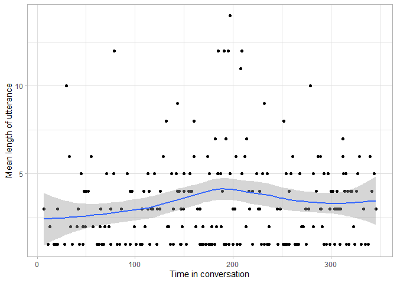
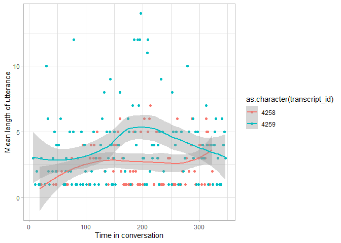
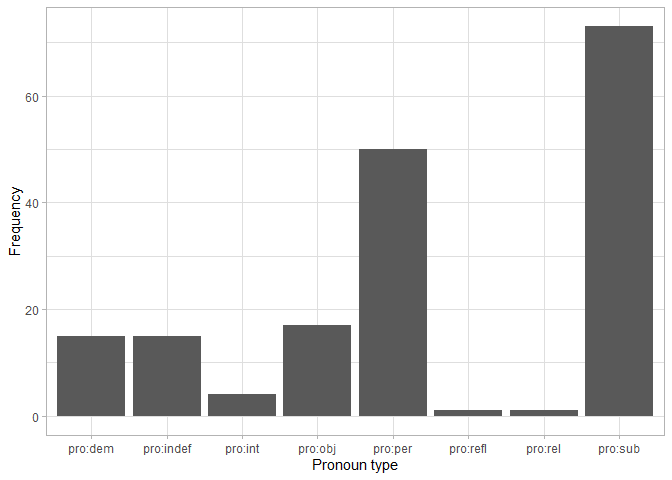

- [Learning outcomes](#learning-outcomes)
- [First steps](#first-steps)
- [Getting data from the CHILDES
  database](#getting-data-from-the-childes-database)
- [Data manipulation](#data-manipulation)
  - [Counting frequencies](#counting-frequencies)
  - [Filtering the data](#filtering-the-data)
  - [Tidy workflows](#tidy-workflows)
  - [Regular expressions (regex)](#regular-expressions-regex)
- [Plotting with `ggplot`](#plotting-with-ggplot)

# Learning outcomes

In this tutorial you learn the steps needed to conduct basic text
analysis in R using the CHILDES database of child language development.
You will need these skills in the small homework assignment following
this workshop, and in case you choose to complete a data assignment
instead of an experiment for your final poster.

You learn how to import data into R with the `childesr` package, how to
use basic text analysis tools, and how to visualize your results using
the `ggplot2` package.

# First steps

This tutorial assumes that you completed the preparatory steps listed
[here](../../SCICOGN302#first_workshop).

If you get stuck at any point, check the help files of functions (access
by running `?functionname`), look at more extensive [Data Center
tutorials](../../../tutorials), try googling your question, attend Data
Center office hours (TBA) or email <datacenter@ucr.nl>.

The code used in this tutorial is also available on
[Github](https://github.com/ucrdatacenter/projects/blob/main/SCICOGN302/2024h2/workshop1code.R).

# Getting data from the CHILDES database

Open a new script and load the `tidyverse`, `tidytext` and `childesr`
packages. We use `tidyverse` for data cleaning and plotting, `tidytext`
for text analysis tools, and `childesr` to access the CHILDES database
from within R.

``` r
library(tidyverse)
library(tidytext)
library(childesr)
```

The CHILDES database contains over 50 000 transcripts, featuring
children at various ages and speaking various languages. To get an idea
of what data is available, have a look at their [searchable online
database](https://sla.talkbank.org/TBB/childes).

In this tutorial use data from a single, English-speaking child called
Amy, who has two transcripts available in the “VanKleeck” corpus. For
your own project(s), you should explore the database further to find a
suitable sample.

In the online database transcripts are available as single raw text
files, which would require some data cleaning before you can
conveniently work with them in R. If you use the `childesr` package to
load the data, then the transcripts will already load as clean
dataframes.

You have two options for how your data should look like:

- If you only conduct analysis on the word level, you should use the
  `get_tokens()` function. One row in your dataframe will correspond to
  one token (a token is generally a single word).
- If you want to analyse longer expressions (up to full sentences), you
  should use the `get_utterances()` function. One row in your dataframe
  will correspond to one utterance (an utterance is a
  phrase/expression/sentence (fragment))

In this tutorial we show examples of how to work with both data types.
For the case of studying the transcripts of Amy, you can load the
token-based and utterance-based datasets as follows:

``` r
tokens <- get_tokens(token = "*", collection = "Eng-NA", target_child = "Amy",
                     corpus = "VanKleeck", role = "target_child")

utterances <- get_utterances(collection = "Eng-NA", target_child = "Amy",
                             corpus = "VanKleeck", role = "target_child")
```

Some notes for using different samples:

- `token = "*"` means to download all words in the transcript, and is a
  necessary argument of `get_tokens()`.
- `collection` and `corpus` specify the location of the transcripts and
  correspond to the categories in the [online
  database](https://sla.talkbank.org/TBB/childes).
- `role = "target_child"` means to download only the speech of the
  child, and not the parents or researchers having a conversation with
  the child. For other filters you can use, check the help files of the
  functions.
- Don’t try to download large sets of transcripts, such as an entire
  collection without adding filters. Check the [online
  database](https://sla.talkbank.org/TBB/childes) to see whether the
  sample that you are considering has a reasonable size.

You can view the downloaded dataframes by calling the `View()` function
or clicking on the name of the dataframes in the Environment tab.

The key variables of `tokens` (token-based dataframe) are

- gloss: token(/word) as used in the speech
- stem: stem of the word in gloss
- part_of_speech: syntactic function of the word
- language, corpus\_…, collection\_… speaker\_…, target_child\_…:
  transcript metadata

The key variables of `utterances` (utterance-based dataframe) are

- gloss: utterance (built from tokens) as used in the speech
- stem: stem of each word in the utterance
- part_of_speech: syntactic structure of the utterance
- num_tokens: number of tokens in the utterance
- language, corpus\_…, collection\_… speaker\_…, target_child\_…:
  transcript metadata

# Data manipulation

## Counting frequencies

Let’s say you want to know what words Amy uses most frequently. To count
how many times each word occurs, you can use the `count()` function. You
need to specify the data and the variable that you’d like to count as
the function arguments, and assign the result to a new object to store
it in R’s memory. We use the “stem” variable instead of “gloss” to
ignore suffixes, conjugation, etc. and set `sort = TRUE` to display the
results from most to least frequent. Then we can print the top 10 most
common words.

``` r
n_tokens <- count(tokens, stem, sort = TRUE)
head(n_tokens, 10)
```

    ## # A tibble: 10 × 2
    ##    stem      n
    ##    <chr> <int>
    ##  1 "I"      51
    ##  2 ""       30
    ##  3 "it"     29
    ##  4 "be"     28
    ##  5 "go"     24
    ##  6 "you"    21
    ##  7 "the"    19
    ##  8 "a"      18
    ##  9 "in"     17
    ## 10 "no"     13

You can see that these results do not tell us much. All of these words
are very common and generic, and most don’t hold much meaning – they are
so-called stopwords. In addition, the second most common token is blank
(i.e. no intelligible word).

## Filtering the data

To make our results more useful, we should filter the dataset first to
keep only relevant observations. One way to do that is with the
`filter()` function, which specifies the criteria that the data should
meet in order to remain in the filtered dataset using logical
expressions. For text analysis the most important logical operators are

- `==` to mean an exact match (e.g. `gloss == "cake"` would only keep
  observations where Amy said “cake”)
- `%in%` to mean that the value matches one of multiple options
  (e.g. `gloss %in% c("cake", "presents")` would keep observations where
  Amy said “cake” OR “presents”)
- `!` which negates whatever statement it precedes (for exact matches
  the negated operator becomes `!=`).

You can also combine logical statements with `&` (and) and `|` (or)
connectors. For instance, `gloss %in% c("cake", "presents")` is
equivalent to `gloss == "cake" | gloss == "presents"`. Used inside a
`filter()` function, this would keep observations where Amy said “cake”
OR “presents”.

``` r
filter(tokens, gloss %in% c("cake", "presents"))
```

    ## # A tibble: 3 × 28
    ##       id gloss language token_order prefix part_of_speech stem  actual_phonology
    ##    <int> <chr> <chr>          <int> <chr>  <chr>          <chr> <chr>           
    ## 1 3.50e6 cake  eng                2 ""     n              cake  ""              
    ## 2 3.50e6 pres… eng                1 ""     n              pres… ""              
    ## 3 3.50e6 cake  eng                4 ""     n              cake  ""              
    ## # ℹ 20 more variables: model_phonology <chr>, suffix <chr>,
    ## #   num_morphemes <int>, english <chr>, clitic <chr>, utterance_type <chr>,
    ## #   corpus_name <chr>, speaker_code <chr>, speaker_name <chr>,
    ## #   speaker_role <chr>, target_child_name <chr>, target_child_age <dbl>,
    ## #   target_child_sex <chr>, collection_name <chr>, collection_id <int>,
    ## #   corpus_id <int>, speaker_id <int>, target_child_id <int>,
    ## #   transcript_id <int>, utterance_id <int>

Another way to filter a dataset is to use the `anti_join()` function.
With this function, you can remove all observations that also occur in a
different dataset. This function can be especially useful if you want to
exclude particular combinations of multiple variables, but it can also
be used to remove stopwords from your dataset.

We can use the pre-defined dataset `stop_words` from the `stopwords`
package to get a list of stopwords. This function creates a dataframe
which has a variable `word` that serves as a list of stopwords. We can
use the `anti_join()` function to keep only the words in `tokens` that
are not in the stopword list. We need to specify the variables that we
want to compare in the `by` argument. In our case, the `word` variable
in the stop_words dataframe corresponds to the `stem` variable in the
tokens dataframe.

``` r
tokens_filtered <- anti_join(tokens, stop_words, by = c("stem" = "word"))
```

Now we can use the `count()` function on our filtered data, and the
results are very different than before.

``` r
n_filtered <- count(tokens_filtered, stem, sort = TRUE)
head(n_filtered, 10)
```

    ## # A tibble: 10 × 2
    ##    stem           n
    ##    <chr>      <int>
    ##  1 "I"           51
    ##  2 ""            30
    ##  3 "uhhuh"       10
    ##  4 "blow"         7
    ##  5 "play"         7
    ##  6 "uhuh"         6
    ##  7 "yum"          6
    ##  8 "house"        5
    ##  9 "yeah"         5
    ## 10 "all_gone"     3

These words are less generic, and actually look like words that children
likely say a lot.

## Tidy workflows

Instead of going through the previous previous two steps by assigning
each intermediate result to a new object (see `tokens_filtered`), you
can write a linear worflow where you start with your original data,
apply each data manipulation step-by-step until you reach your final
result.

To create such a workflow, you need the pipe operator (`%>%`): using it
at the end of a line means that the next function uses the previous
result as an input. In the following case, it takes the object `tokens`
as the first argument of the `anti_join()` function, then introduces an
additional filter to remove words where the stem is blank, and finally
takes the resulting filtered data as the first argument of the `count()`
function.

``` r
n_filtered <- tokens %>% 
  anti_join(stop_words, by = c("stem" = "word")) %>%
  filter(stem != "") %>% 
  count(stem, sort = TRUE)
```

## Regular expressions (regex)

When working with text data, looking for direct matches with logical
operators is often not sufficient. For example if you want to find all
utterances that include the phrase “he is”, `filter(gloss == "he is")`
will not keep “he is tall”, because it only looks for exact matches. No
more, no less.

To get results that match a certain pattern (e.g. starting in a specific
way or containing a particular sequence), we can use regular
expressions. These expressions practically form a language of their own,
and their advanced use can get very complex, but the basics are
straightforward. You specify the pattern (e.g. contains “he is”), and
specify the string in which you want to find that pattern (e.g. the
gloss variable of the utt dataframe). Then you can use the
`str_detect()` function to find matches: `str_detect()` returns a
logical vector that you can use in the `filter()` function.

``` r
utterances %>% 
  filter(str_detect(gloss, "he is"))
```

    ## # A tibble: 4 × 27
    ##       id gloss             stem  actual_phonology model_phonology type  language
    ##    <int> <chr>             <chr> <chr>            <chr>           <chr> <chr>   
    ## 1 811024 she is my little… she … ""               ""              decl… eng     
    ## 2 811700 he is xxx airpla… he b… ""               ""              decl… eng     
    ## 3 811746 he is standing u… he b… ""               ""              decl… eng     
    ## 4 811763 now he is gonna … now … ""               ""              decl… eng     
    ## # ℹ 20 more variables: num_morphemes <int>, num_tokens <int>,
    ## #   utterance_order <int>, corpus_name <chr>, part_of_speech <chr>,
    ## #   speaker_code <chr>, speaker_name <chr>, speaker_role <chr>,
    ## #   target_child_name <chr>, target_child_age <dbl>, target_child_sex <chr>,
    ## #   media_start <dbl>, media_end <dbl>, media_unit <chr>,
    ## #   collection_name <chr>, collection_id <int>, corpus_id <int>,
    ## #   speaker_id <int>, target_child_id <int>, transcript_id <int>

As you can see, Amy said the phrase “he is” four times, of which one
time she said “she is”. We can use regular expressions to further narrow
down our results. Some of the most useful regex patterns are

- `^x` starts with x
- `x$` ends with x
- `(x|y)` x or y
- `.` any character
- `x*` x any number of times

So if we wanted to exclude “she is” from the previous results, the
regular expression `"(^| )he is"` would do that: we look for the phrase
“he is” either at the beginning of the phrase or preceded by whitespace.

For other regex patterns, see the second page of [this cheat
sheet](https://evoldyn.gitlab.io/evomics-2018/ref-sheets/R_strings.pdf).

# Plotting with `ggplot`

Figures made with `ggplot` are built from several layers. You always use
the same basic code structure to create a wide range of figures:

1.  The `ggplot()` function creates a blank canvas for you to work on.
2.  Geoms add the visual elements, such as points, lines, bars, or other
    shapes.
3.  Other specifications can include changing axis settings, setting the
    theme, adding labels, etc.
4.  You connect all these different specifications to each other using
    `+` signs (similarly as you’d use the pipe operator `%>%`).

The variables that you want to display on the graph must always be
wrapped in an `aes()` function, which stands for aesthetics. This
specification tells R to determine the value of the aesthetic (x and y
axes, colors, groups, line types, etc.) based on the value of the
variable. `aes()` can be specified both in the main `ggplot()` function
(in which case it will apply to all geoms) or within a `geom_...()`
function (then it only applies to that geom).

Common plot types include

- scatterplots (`geom_point()`)
- line charts (`geom_line()`)
- bar charts (`geom_col()` and `geom_bar()`)
- histograms (`geom_histogram()`)
- fitted curves (`geom_smooth()`)

For instance you can create a bar chart of the frequencies of the 10
most common words Amy uses. We can use the `reorder()` function to
arrange the columns by frequency.

``` r
n_filtered %>% 
  head(10) %>% 
  ggplot() +
  geom_col(aes(x = n, y = reorder(stem, n))) +
  labs(x = "Frequency", y = "")
```

<!-- -->

To observe language development, it is interesting to look at how
various measures change with age. Since we only observe Amy at one age,
we can’t plot that here, but as an alternative we can use the
`utterance_order` variable to see whether Amy’s speech patterns change
over the course of one conversation.

For example, we can plot the mean utterance length (equivalent to mean
length of utterance (MLU), a common measure of language development) as
a scatterplot with a fitted curve. Note that if you specify aesthetics
in the `ggplot()` function, they apply to all geoms.

``` r
utterances %>% 
  ggplot(aes(x = utterance_order, y = num_tokens)) +
  geom_point() +
  geom_smooth() +
  labs(x = "Time in conversation", y = "Mean length of utterance") +
  theme_light()
```

<!-- -->

From this plot we can see that while there are some particularly long
utterances Amy made during the conversations, there is no clear pattern
of increasing or decreasing utterance length during the conversation.

Since we have two transcripts from Amy, we can compare language
development measures in the two transcripts (for your assignment yo can
compare multiple children in a similar way). This figure is the same as
the previous one, except that it specifies `transcript_id` as the
grouping variable that should affect the color of the points, and
therefore fits separate lines per transcript.

``` r
utterances %>% 
  ggplot(aes(x = utterance_order, y = num_tokens, 
             color = as.character(transcript_id))) +
  geom_point() +
  geom_smooth() +
  labs(x = "Time in conversation", y = "Mean length of utterance") +
  theme_light()
```

<!-- -->

This plot tells us that the second transcript seems to have a slightly
larger MLU, mainly because most of the particularly long utterances
occurred in the second conversation.

We can also use regular expressions to look for particular patterns. For
instance, we can check which types of pronouns (denoted `pro:type`) Amy
uses the most.

``` r
tokens %>% 
  filter(str_detect(part_of_speech, "pro:")) %>% 
  count(part_of_speech) %>% 
  ggplot() +
  geom_col(aes(x = part_of_speech, y = n)) +
  labs(x = "Pronoun type", y = "Frequency") +
  theme_light()
```

<!-- -->

Subjective and personal pronouns (I, you, etc.) are clearly dominating
Amy’s speech, however, she uses a wide range of different pronouns.

If you would like a brief introduction to some more useful functions in
calculating measures of linguistic development, have a look at the
workshop [additional materials](../workshop1extra).
