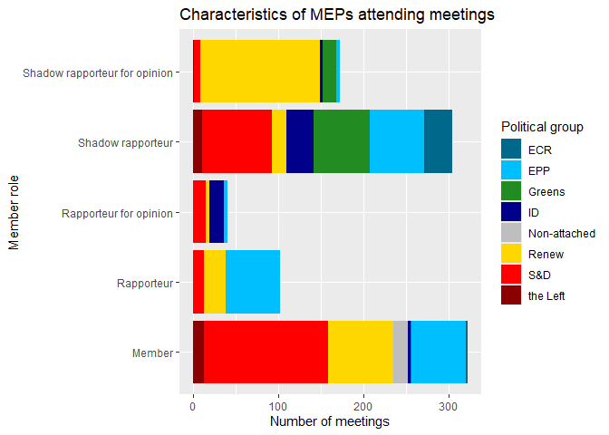
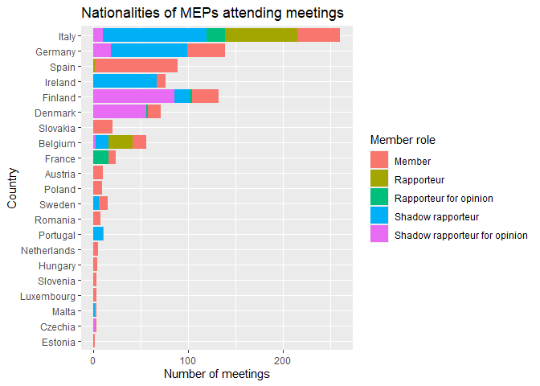
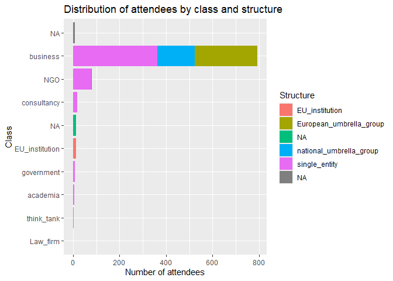
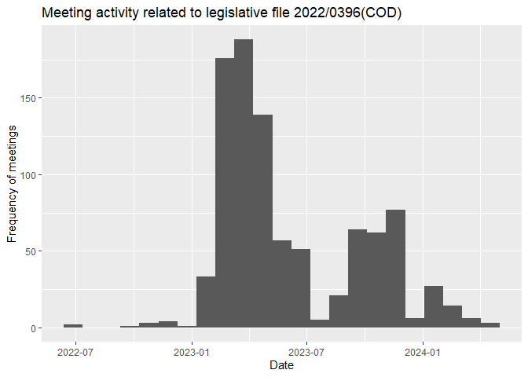

- [Preparation for the workshop](#preparation-for-the-workshop)
- [Analyzing legislative dossiers in
  R](#analyzing-legislative-dossiers-in-r)
  - [Loading the data](#loading-the-data)
  - [MEP characteristics](#mep-characteristics)
  - [Attendee characteristics](#attendee-characteristics)
  - [Meeting timeline](#meeting-timeline)

# Preparation for the workshop

In the last Data Center workshop, each group will analyze the meetings
related to a specific legislative dossier. You can find a list of the
dossiers and the number of corresponding meetings and attendees
[here](https://github.com/ucrdatacenter/projects/blob/main/SSCPOLI302/2024h2/List%20of%20legislative%20files.pdf).

You can find the full meeting data
[here](https://github.com/ucrdatacenter/projects/blob/main/SSCPOLI302/2024h2/meetings_per_attendee.xlsx).
This file is almost the same as the file you worked with in the first
workshop, except that it only includes meetings with a linked
legislative dossier, and if the meeting listed multiple attendees, each
attendee is listed on a separate row. We will work with this dataset for
the rest of this example.

Unfortunately, the data is not standardized, and the attendees are not
always reported in the same format. Therefore, you will need to clean
the data to make it usable for analysis. To help you with this task, we
have created files that list the unique attendee names that occur for
each legislative dossier.

Once you know which legislative dossier your group will analyze, you can
download the file containing the relevant attendee names from
[GitHub](https://github.com/ucrdatacenter/projects/tree/main/SSCPOLI302/2024h2/attendees)
(click on the file, then click the “View Raw” button to download the
file). Download the file to your project directory, open it in Excel.

You can find instructions for how to clean and standardize the data in
Excel in [this
tutorial](https://github.com/ucrdatacenter/projects/blob/main/SSCPOLI302/2024h2/Data%20cleaning%20instructions.pdf).
Please follow the instructions carefully and have your cleaned data file
ready for the workshop. If you get stuck or have any questions, please
attend the Data Center’s office hours ([schedule](../../../contact)) or
email us at <datacenter@ucr.nl>.

# Analyzing legislative dossiers in R

## Loading the data

Once you have cleaned the data, you can start analyzing it in R. Below
is a template for the analysis using for the dossier 2022/0396(COD),
which is regulating packaging and packaging waste. Our cleaned data is
stored in our project directory and is called
“2022_0396_COD_clean.xlsx”.

In this first code chunk, you only need to change the file name and the
dossier reference (see comments) to match your data. This code will load
the meeting data, filter it for the dossier of interest, load the
cleaned list of attendees, and combine the two datasets. So in the data
we will have not only the meetings related to the dossier 2022/0396(COD)
as declared in the original data, but also the standardized attendee
names and categories.

``` r
# load the necessary libraries (install if needed)
library(tidyverse)
library(rio)

# load the meeting data and filter for the dossier of interest
meetings_raw <- import("https://github.com/ucrdatacenter/projects/raw/main/SSCPOLI302/2024h2/meetings_per_attendee.xlsx", setclass = "tbl_df") |> 
  mutate(meeting_date = as.Date(meeting_date))

# load the cleaned list of attendees (change the file name to match your data)
attendees <- import("2022_0396_COD_clean.xlsx", setclass = "tbl_df")

# combine the two datasets
meetings <- meetings_raw |> 
  # filter for dossier of interest (change the reference to match your dossier)
  filter(procedure_reference == "2022/0396(COD)") |> 
  left_join(attendees, by = "attendees")
```

## MEP characteristics

The main analysis of the file will largely follow the same steps as the
ones for the complete EP dataset. We mainly use the `count()` function
to learn more about the distribution of MEP and attendee characteristics
at the meetings related to the dossier.

First, we can look at the distribution of MEPs by their political group
and role – this is very similar to the analysis we did in the previous
workshop, except now we restrict the sample to a legislative dossier. We
can reuse the code from the previous workshop to create a bar chart for
member role and color the bars by political groups.

``` r
# define political group colors
colors <- c("EPP" = "deepskyblue", 
            "S&D" = "red",
            "Renew" = "gold", 
            "Greens" = "forestgreen",
            "ECR" = "deepskyblue4", 
            "ID" = "darkblue", 
            "the Left" = "darkred", 
            "Non-attached" = "grey")

# count how many meetings each MEP attended by political group and role
meetings |> 
  count(political_group, member_capacity, sort = TRUE) |> 
  ggplot() +
  geom_col(aes(x = n, y = member_capacity, fill = political_group)) +
  scale_fill_manual(values = colors) +
  labs(title = "Characteristics of MEPs attending meetings", 
       y = "Member role", 
       x = "Number of meetings",
       fill = "Political group")
```

<!-- -->

Another MEP characteristic we can look at is their nationality. Let’s
add both nationalities and member roles to a bar chart.

``` r
# count the MEP nationalities in the data
meetings |> 
  count(country, member_capacity, sort = TRUE) |> 
  ggplot() +
  geom_col(aes(x = n, y = reorder(country, n), fill = member_capacity)) +
  labs(title = "Nationalities of MEPs attending meetings", 
       y = "Country", 
       x = "Number of meetings",
       fill = "Member role")
```

<!-- -->

## Attendee characteristics

With our improved dataset we can also do some additional analyses by
looking at the nature of the actors that were involved.

First, let’s look at who the attendees are and how many meetings they
each attended.

``` r
# count how many meetings each attendee attended (using the fixed names)
meetings |> 
  count(fixed_names, sort = TRUE)
```

    ## # A tibble: 372 × 2
    ##    fixed_names                                                                 n
    ##    <chr>                                                                   <int>
    ##  1 McDonald’s Global Franchising Limited (MGFL) - Transparency Register N…    20
    ##  2 European Paper Packaging Alliance (EPPA) - Transparency Register Numbe…    18
    ##  3 Huhtamäki Oyj                                                              18
    ##  4 European Environmental Bureau (EEB) - Transparency Register Number: 06…    17
    ##  5 Nestlé S.A.                                                                17
    ##  6 The European Organisation for Packaging and the Environment (EUROPEN) …    15
    ##  7 The Coca-Cola Company                                                      14
    ##  8 Zero Waste Europe (ZWE) - Transparency Register Number: 47806848200-34     14
    ##  9 FoodDrinkEurope - Transparency Register Number: 75818824519-45             13
    ## 10 Seda International Packaging Group                                         13
    ## # ℹ 362 more rows

This list contains too many different entities to create a readable
plots, so let’s try to group the attendees by their class and structure,
which we previously defined manually. Then we can plot the distribution
of these categories.

``` r
# count attendee class and structure
meetings |> 
  count(class, structure, sort = TRUE) |> 
  ggplot() +
  geom_col(aes(x = n, y = reorder(class, n), fill = structure)) +
  labs(title = "Distribution of attendees by class and structure", 
       y = "Class", 
       x = "Number of attendees",
       fill = "Structure")
```

<!-- -->

You can also try different combinations of variables – e.g. combine
attendee and MEP characteristics on one plot – to see if there are any
interesting patterns.

## Meeting timeline

Lastly, we can look at the timeline of the lobbying activity to see if
there are patterns related to events during the file’s legislative
procedure.

``` r
# meeting timeline for the dossier
meetings |>
  ggplot() +
  geom_histogram(aes(x = meeting_date), binwidth = 30) +
  labs(title = "Meeting activity related to legislative file 2022/0396(COD)", 
       x = "Date", 
       y = "Frequency of meetings")
```

<!-- -->

We can see a few peaks around specific dates. These are worth examining
further. Using external sources, we can try to uncover what events took
place at this point. Examples if influential events may be the
appointments of committees, parliament votes, amendments, court verdicts
or the emergence of major crises/scandals.

<https://www.europarl.europa.eu/legislative-train/schedule>

<https://oeil.secure.europarl.europa.eu/oeil/home/home.do>

<https://parltrack.org/dossier/2022/0396(COD)#/general>

Optionally, we can also look at whether these attendees met with
European Institutions besides the EP. This could signify a larger
strategy and could tell us more about access to European institutions.

<https://transparency-register.europa.eu/searchregister-or-update/search-register_en>
