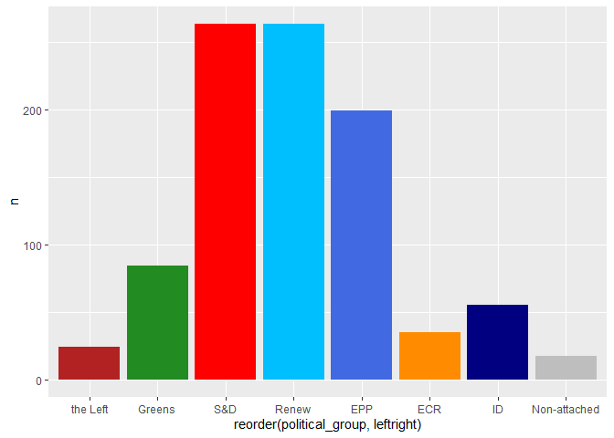
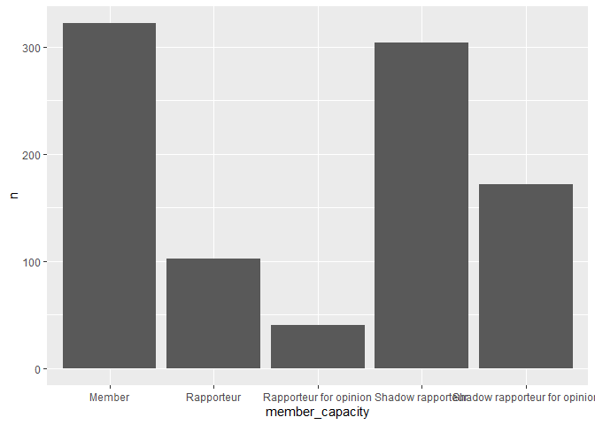
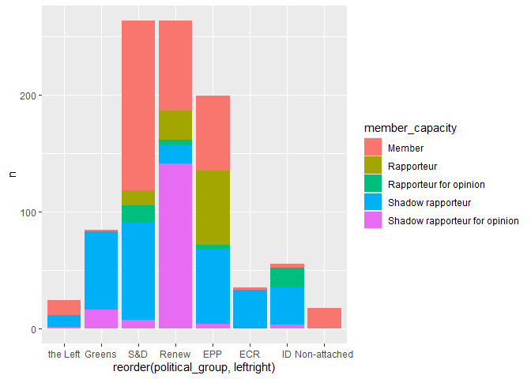
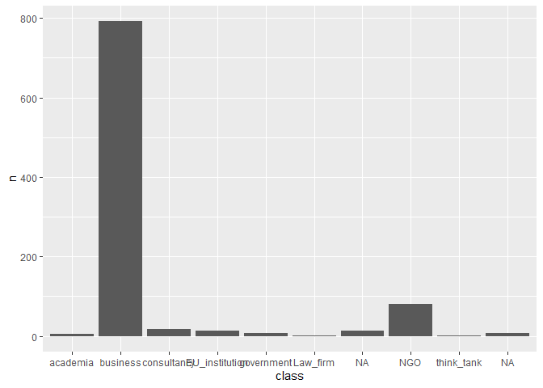
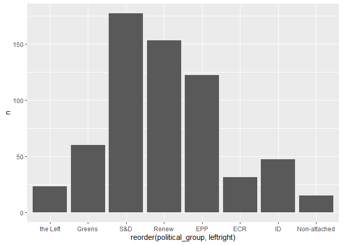
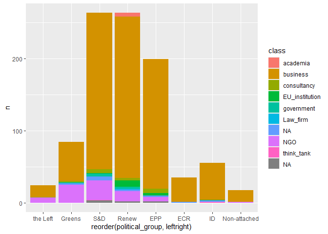
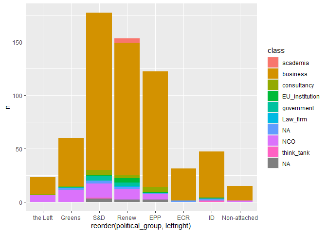
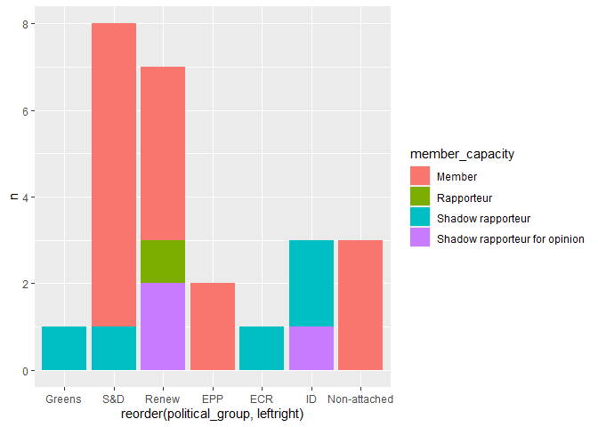
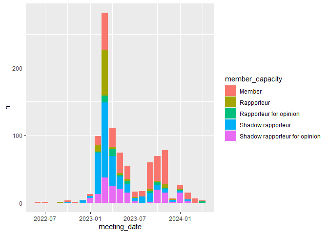

- [Loading the data](#loading-the-data)
- [Exploring meeting distributions](#exploring-meeting-distributions)
- [Finding the most active MEPs and
  organizations](#finding-the-most-active-meps-and-organizations)

# Loading the data

Once you have cleaned the data, you can start analyzing it in R. Below
is a template for the analysis using for the dossier 2022/0396(COD),
which is regulating packaging and packaging waste. Our cleaned data is
stored in our project directory and is called
“2022_0396_COD_clean.xlsx”.

In this first code chunk, you only need to change the file name and the
dossier reference (see comments) to match your data. This code will load
the meeting data, filter it for the dossier of interest, load the
cleaned list of attendees, and combine the two datasets. So in the data
we will have not only the meetings related to the dossier 2022/0396(COD)
as declared in the original data, but also the standardized attendee
names and categories.

``` r
# load the necessary libraries (install if needed)
library(tidyverse)
library(rio)

# import meeting data
meetings_raw <- import("https://github.com/ucrdatacenter/projects/raw/main/SSCPOLI302/2024h2/meetings_per_attendee.xlsx", setclass = "tbl_df") |>
  mutate(meeting_date = as.Date(meeting_date)) |>
  drop_na(procedure_reference)

# import attendee data from packaging waste file
attendees <- import("https://github.com/ucrdatacenter/projects/raw/main/SSCPOLI302/2024h2/attendees/2022_0396_COD_clean.xlsx", setclass = "tbl_df")
# import your own data from the file you copied into your Project Folder
# attendees <- import("YourFileName.xlsx", setclass = "tbl_df")

# retain data for your dossier, then merge with attendee data
meetings <- meetings_raw |>
  filter(procedure_reference == "2022/0396(COD)") |>
  left_join(attendees, by = "attendees")
```

To help make our figures, we can define some additional political groups
characteristics. We will use this information to color our plots and to
order the political groups in the plots.

``` r
# assigning colors and names
seats <- tribble(
  ~political_group, ~seats, ~leftright, ~color, ~longname,
  "the Left", 37, 1, "firebrick", "The Left in the European Parliament (GUE/NGL)",
  "Greens", 70, 2, "forestgreen", "Greens/European Free Alliance",
  "S&D", 138, 3, "red", "Progressive Alliance of Socialists and Democrats",
  "Renew", 98, 4, "deepskyblue", "Renew Europe",
  "EPP", 179, 5, "royalblue", "European People's Party",
  "ECR", 69, 6, "darkorange", "European Conservatives and Reformists",
  "ID", 49, 7, "navy", "Identity and Democracy",
  "Non-attached", 63, 8, "gray", "Non-attached Members"
)
```

# Exploring meeting distributions

``` r
# number of meetings per political group
meetings |>
  count(political_group) |>
  left_join(seats) |>
  ggplot(
    aes(x = reorder(political_group, leftright), y = n, fill = color)
  ) +
  geom_col() +
  scale_fill_identity()
```

<!-- -->

``` 2
#   number of meetings per seat per political group
meetings |>
  count(political_group) |>
  left_join(seats) |>
  mutate(meetings_per_seat = n / seats) |>
  ggplot(
    aes(x = reorder(political_group, leftright), y = meetings_per_seat, fill = color)
  ) +
  geom_col() + scale_fill_identity()
```

``` r
#   number of meetings by MEP-role
meetings |>
  count(member_capacity) |>
  ggplot(
    aes(x = member_capacity, y = n)
  ) +
  geom_col()
```

<!-- -->

``` r
# number of meetings by MEP-role and by political group
meetings |>
  count(member_capacity, political_group) |>
  left_join(seats) |>
  ggplot(
    aes(x = reorder(political_group,leftright), y = n, fill = member_capacity)
  ) +
  geom_col()
```

<!-- -->

``` r
# number of meetings by organization type
meetings |>
  count(class) |>
  ggplot(
    aes(x = class, y = n)
  ) +
  geom_col()
```

<!-- -->

``` r
# number of organizations by political group
meetings |>
  count(political_group, fixed_names) |>
  count(political_group) |>
  left_join(seats) |>
  ggplot(
    aes(x = reorder(political_group, leftright), y = n)
  ) +
  geom_col()
```

<!-- -->

``` r
# number of meetings by political group and by class
meetings |>
  count(class, political_group, sort = T) |>
  left_join(seats) |>
  ggplot(
    aes(x = reorder(political_group,leftright), y = n, fill = class)
  ) +
  geom_col()
```

<!-- -->

``` r
# number of organizations by political group and by class
meetings |>
  count(class, political_group, fixed_names, sort = T) |>
  count(class, political_group) |>
  left_join(seats) |>
  ggplot(
    aes(x = reorder(political_group,leftright), y = n, fill = class)
  ) +
  geom_col()
```

<!-- -->

# Finding the most active MEPs and organizations

``` r
# number of contacts per fixed_name by political group
orgxgroups <- meetings |>
  count(political_group, fixed_names) |>
  group_by(fixed_names) |>
  mutate(total_meetings = sum(n)) |>
  pivot_wider(names_from = political_group, values_from = n) |>
  arrange(desc(total_meetings))
```

``` r
# list individual MEPs with most meetings and their political group and roles and distribution over type
ranked_meps <- meetings |>
  count(member_name, member_capacity, political_group, name = "number_of_meetings") |>
  left_join(
    meetings |>
      filter(class == "NGO") |>
      count(member_name, member_capacity, name = "ngo_meetings"),
    by = c("member_name", "member_capacity")
  ) |>
  left_join(
    meetings |>
      filter(class == "business") |>
      count(member_name, member_capacity, name = "business_meetings"),
    by = c("member_name", "member_capacity")
  ) |>
  replace_na(list(ngo_meetings = 0, business_meetings = 0)) |>
  arrange(desc(number_of_meetings))
```

``` r
# alternative code with the same result
ranked_meps <- meetings |>
  drop_na(class) |>
  group_by(country, member_capacity, political_group, member_id, member_name) |>
  summarize(
    business = sum(class == "business"),
    ngo = sum(class == "NGO"),
    total = n()
  ) |>
  arrange(desc(total))
```

``` r
# showing meetings for a specific interest group (McDonalds)
meetings |>
  filter(str_detect(fixed_names, "Donal")) |>
  count(political_group, member_capacity) |>
  left_join(seats) |>
  ggplot(
    aes(x = reorder(political_group,leftright), y = n, fill = member_capacity)
  ) +
  geom_col()
```

<!-- -->

``` r
# timing of meetings by MEP role
meetings |>
  mutate(meeting_date = floor_date(meeting_date, unit = "months")) |>
  count(member_capacity, meeting_date) |>
  ggplot(
    aes(x = meeting_date, y = n, fill = member_capacity)
  ) +
  geom_col()
```

<!-- -->
