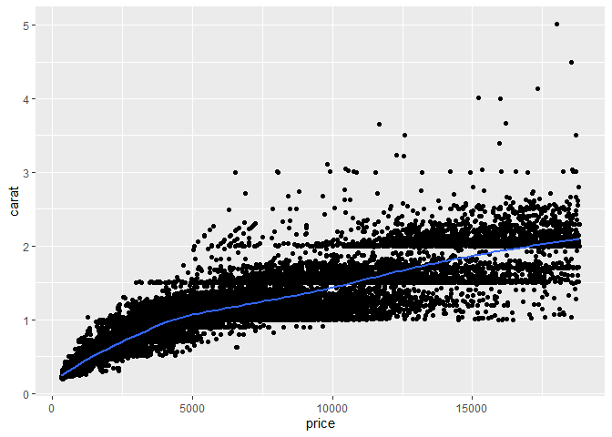
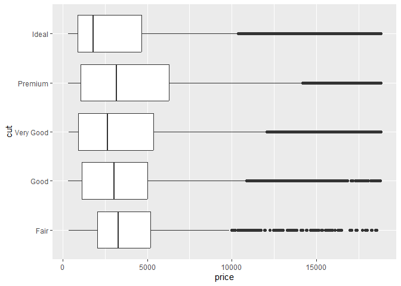
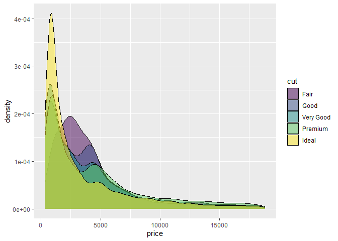
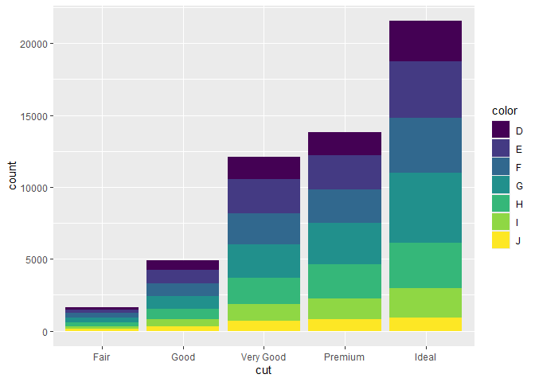
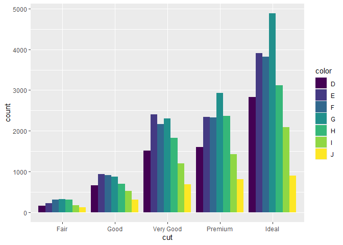
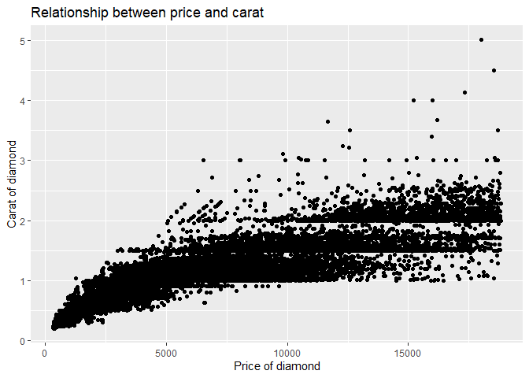

# Introduction

Before you proceed, make sure you’re familiar with the logic of
`ggplot`, as explained in our [introduction to `ggplot`
tutorial](../r_ggplot_intro).

We’ll use the `diamonds` dataset that comes pre-loaded with `tidyverse`
to demonstrate how to plot relationships between two variables, so let’s
load `tidyverse` and have a look at the dataset:

``` r
# load tidyverse
library(tidyverse)

# add diamonds to the environment
data(diamonds)
```

# Bivariate plots

You can plot two continuous variables with a scatter plot. For example,
you can plot the relationship between price and carat by specifying
these variables as the x and y aesthetics:

``` r
# basic scatter plot
ggplot(diamonds, aes(x = price, y = carat)) +
  geom_point()
```

<!-- -->

Fitting a smooth curve or a linear regression line to the scatter plot
can help you see the overall trend in the data.

``` r
# scatter plot with fitted smooth curve
ggplot(diamonds, aes(x = price, y = carat)) +
  geom_point() + 
  geom_smooth()
```

<!-- -->

``` r
# scatter plot with linear regression line
ggplot(diamonds, aes(x = price, y = carat)) +
  geom_point() + 
  # method = "lm" fits a linear model, se = FALSE removes the confidence interval
  geom_smooth(method = "lm", se = FALSE)
```

<!-- -->

Categorical variables can be used to show the distribution of continuous
variables by group. You can put a categorical variable on one of the
axes, or use it on another aesthetic, such as the fill or color. Note
that if a variable determines the fill, the color, and the shape of the
points, that has to be specified inside an `aes()` function, while if
the characteristic is pre-defined, then it goes outside the `aes()`
function. Also note that if you specify aesthetics in the main
`ggplot()` function, then they apply to all geoms, while if you specify
them in a `geom_...()` function, they apply only to that geom.

``` r
# box plot of price by cut
ggplot(diamonds, aes(x = price, y = cut)) +
  geom_boxplot()
```

<!-- -->

``` r
# density plot of price by cut
ggplot(diamonds) +
  geom_density(aes(x = price, fill = cut), alpha = 0.5)
```

<!-- -->

To plot two categorical variables, you can use a bar plot with an extra
grouping argument. For example, we can plot the number of diamonds with
each combination of cut and color:

``` r
ggplot(diamonds, aes(x = cut, fill = color)) +
  geom_bar()
```

<!-- -->

``` r
# to put the bars next to each other instead of on top, specify the position
ggplot(diamonds, aes(x = cut, fill = color)) +
  geom_bar(position = "dodge")
```

<!-- -->

Whenever you make a plot, make sure to use clear labels and titles with
the `labs()` function to make your visualization easy to understand.

``` r
ggplot(diamonds, aes(x = price, y = carat)) +
  geom_point() +
  labs(title = "Relationship between price and carat",
       x = "Price of diamond",
       y = "Carat of diamond")
```

<!-- -->

To learn more about other geoms and customization options, have a look
at our [advanced visualization tutorial](../r_adv_ggplot) and
[additional resources](../links#Help%20with%20%60ggplot%60).
