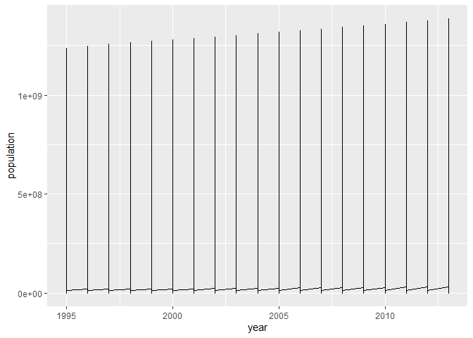
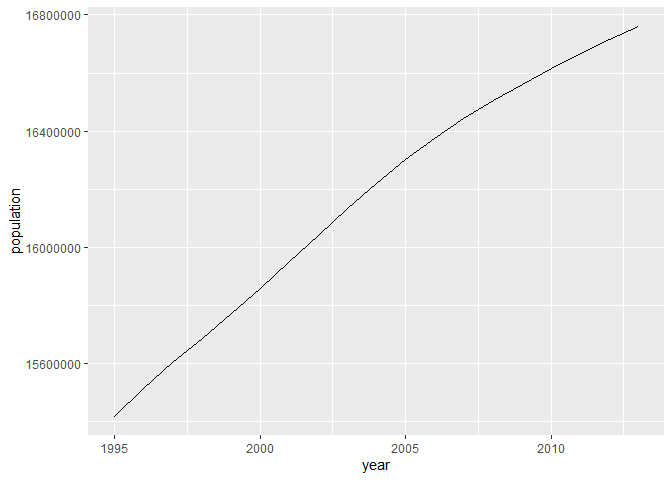
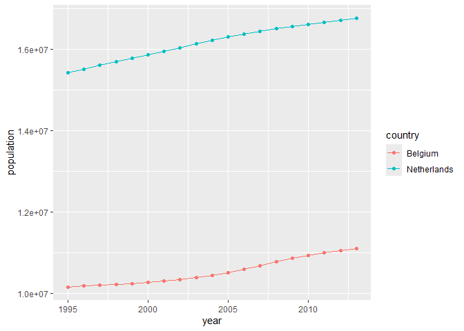
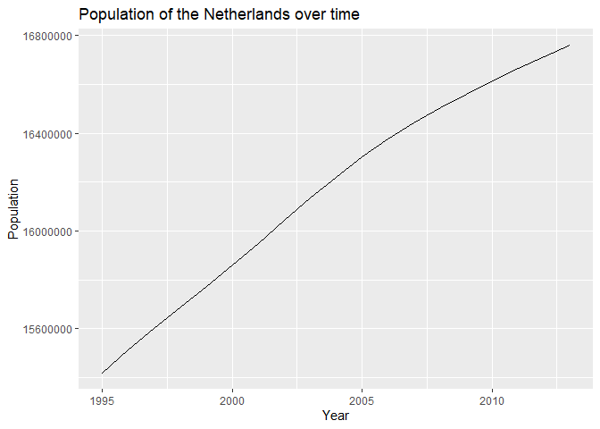

**This tutorial is not ready yet. Please come back later.**

# Introduction

Before you proceed, make sure you’re familiar with the logic of
`ggplot`, as explained in our [introduction to `ggplot`
tutorial](../r_ggplot_intro).

We’ll use the `population` dataset that comes pre-loaded with
`tidyverse` to demonstrate how to plot the evolution of a variable over
time, so let’s load `tidyverse` and have a look at the dataset:

``` r
# load tidyverse
library(tidyverse)

# add population to the environment
data(population)
```

## Time series plots

In a time series plot, the x-axis represents time, and the y-axis
represents the variable you want to visualize. To create a time series
plot, you can use the `line` geom.

Let’s plot the evolution of the `population` variable over time.

``` r
# create a time series plot 
ggplot(population, aes(x = year, y = population)) +
  geom_line()
```

<!-- -->

The plot does not make sense, because in every year we have observations
for multiple countries, and by default `geom_line()` connects all of the
points. Let’s filter the data for a single country before plotting. We
use the `filter()` function – if you’re not familiar with it, have a
look at our corresponding [data wrangling tutorial](../r_intro_subset).

``` r
ggplot(filter(population, country == "Netherlands"), 
       aes(x = year, y = population)) +
  geom_line()
```

<!-- -->

If you’re familiar with the pipe operator `%>%` (see our [tidy workflow
tutorial](../r_intro_pipe)), you can use it to make the code more
readable:

``` r
population %>%
  filter(country == "Netherlands") %>%
  ggplot(aes(x = year, y = population)) +
  geom_line()
```

<!-- -->

You can compare the evolution of the population by adding multiple lines
to the plot and differentiating them by their color. To make it clearer
that we have annual data, we can add points to the plot as well, because
geoms can be layered.

``` r
population %>%
  # keep only data from the Netherlands and Belgium
  filter(country %in% c("Netherlands", "Belgium")) %>%
  # specify the aesthetics for all geoms
  ggplot(aes(x = year, y = population, color = country)) +
  # add a line for each country
  geom_line() +
  # add points for each data point
  geom_point()
```

<!-- -->

Whenever you make a plot, make sure to use clear labels and titles with
the `labs()` function to make your visualization easy to understand.

``` r
population %>%
  filter(country == "Netherlands") %>%
  ggplot(aes(x = year, y = population)) +
  geom_line() +
  labs(title = "Population of the Netherlands over time",
       x = "Year",
       y = "Population")
```

<!-- -->

To learn more about other geoms and customization options, have a look
at our [advanced visualization tutorial](../r_adv_ggplot) and
[additional resources](../links#Help%20with%20%60ggplot%60).

## Video tutorial TBA
