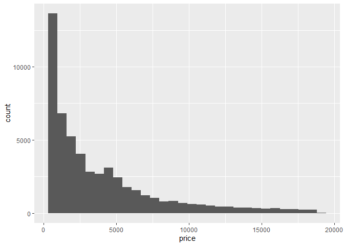
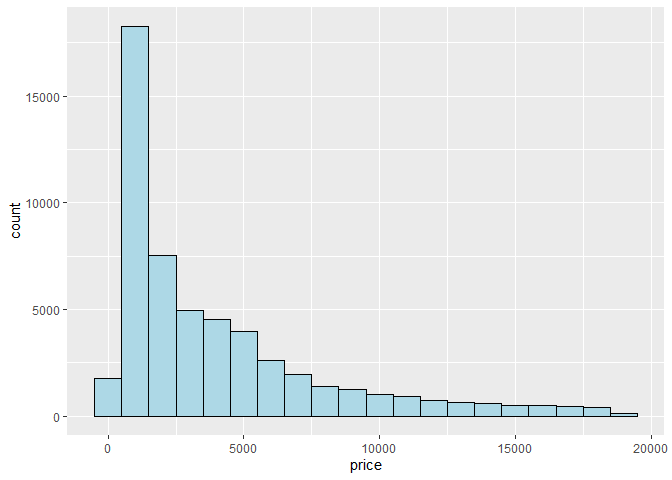
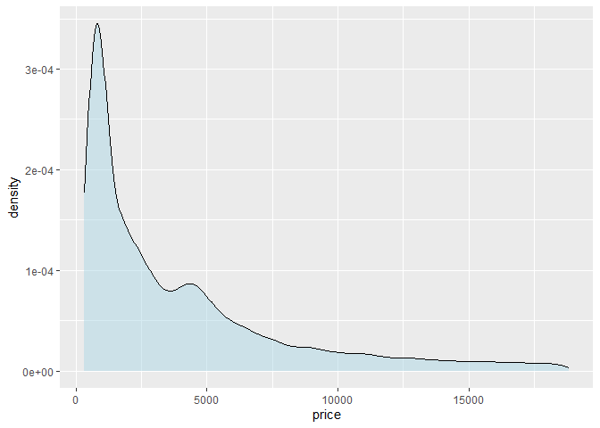
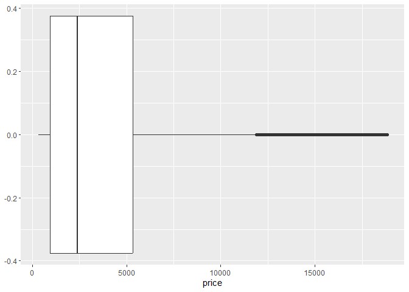
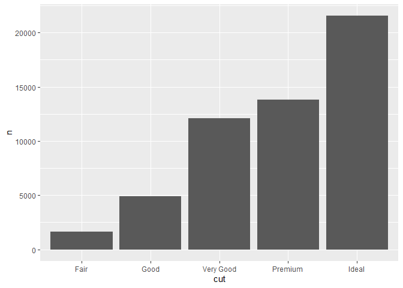
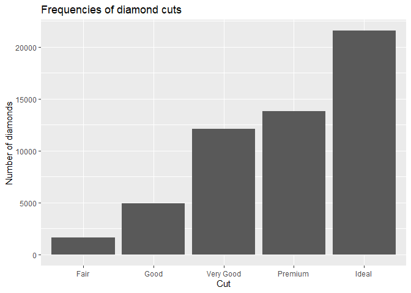

# Video tutorial

Please watch [this](https://vimeo.com/1011773578/3fc4a9fa21) video
(4:40), then read and follow along with the written tutorial below.
Compare your own output to what you see printed below to make sure all
of your code runs as expected.

# Introduction

Before you proceed, make sure you’re familiar with the logic of
`ggplot`, as explained in our [introduction to `ggplot`
tutorial](../r_ggplot_intro).

We’ll use the `diamonds` dataset that comes pre-loaded with `tidyverse`
to demonstrate how to visualize the distribution of a variable with
`ggplot2`, so let’s load `tidyverse` and have a look at the dataset:

``` r
# load tidyverse
library(tidyverse)

# add diamonds to the environment
data(diamonds)
```

# The distribution of a continuous variable

You can plot a single continuous variable with a histogram, a density
plot, or a boxplot. Other than the name of the dataset and the variable
that you want to plot, no additional arguments need to be specified; but
you can customize the plot by adding arguments to the `geom_` functions.

``` r
# basic histogram of price
ggplot(diamonds, aes(x = price)) +
  geom_histogram()
```

<!-- -->

``` r
# custom binwidth or bins determine the number of bins
# with binwidth = 1000, each bin is $1,000 wide
# color affects the border; fill affects the inside
ggplot(diamonds, aes(x = price)) +
  geom_histogram(binwidth = 1000, color = "black", fill = "lightblue")
```

<!-- -->

``` r
# density plot
# alpha adjusts the transparency of the fill
ggplot(diamonds, aes(x = price)) +
  geom_density(fill = "lightblue", alpha = 0.5)
```

<!-- -->

``` r
# boxplot
ggplot(diamonds, aes(x = price)) +
  geom_boxplot()
```

<!-- -->

# The distribution of a discrete variable

To compare the frequencies of discrete variables, you can use a bar
plot.

``` r
ggplot(diamonds, aes(x = cut)) +
  geom_bar()
```

<!-- -->

If you want R to automatically count the frequencies of your variable,
use `geom_bar()` with only an `x` aesthetic. If you have a separate
variable that contains the frequencies (e.g. as the result of a
`count()` function), you can use `geom_col()` with both an `x` and `y`
aesthetic.

Note that the following code uses the pipe operator `|>` to chain the
functions together. The pipe operator is used to pass the output of one
function as the first input to the next function, making the code more
readable. To read more about the pipe operator, see the tutorial on the
[tidy workflow](../r_intro_workflow).

``` r
diamonds |> 
  count(cut) |> 
  ggplot(aes(x = cut, y = n)) +
  geom_col()
```

<!-- -->

# Adding labels

Whenever you make a plot, make sure to use clear labels and titles with
the `labs()` function to make your visualization easy to understand.

``` r
ggplot(diamonds, aes(x = cut)) +
  geom_bar() +
  labs(title = "Frequencies of diamond cuts",
       x = "Cut",
       y = "Number of diamonds")
```

<!-- -->

To learn more about other geoms and customization options, have a look
at our [other tutorials](../) and [additional
resources](../links#Help%20with%20%60ggplot%60).
